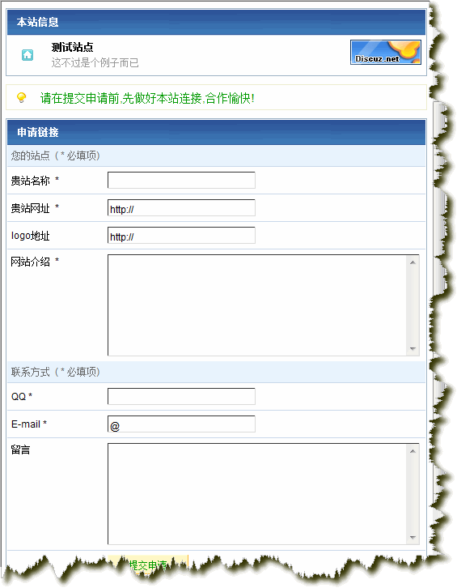

## 描述

你的DZ可以通过页面接受链接申请;

你将收到论坛短消息或者电子邮件通知.

## 安装

解开压缩包,将所有文件上传至你的论坛根目录;

配置link.congfig.php,根据你的需要填写项目.

修改模板目录下的discuz.htm

```html
<span style="font-family: Courier New;"><span class="bold">{lang board\_links}</span></span>
```

在后面加入

```html
<span style="font-family: Courier New;"><span class="smalltxt"><a href="link.php">申请链接</a></span></span>
```

===

## 卸载

删除上传的文件即可.

## 提示

适用于 Discuz!6.0/6.1 简体中文GBK版，请在下载时选择对应版本。

## 截图



## 下载

* <a href="http://www.discuz.net/thread-845369-1-1.html" target="_blank">官方论坛 </a>
* <a href="http://www.fs2you.com/files/5924ce87-4340-11dd-9c58-0014221f4662/" target="_blank">6.1版下载</a>
