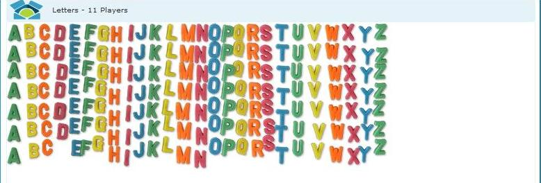
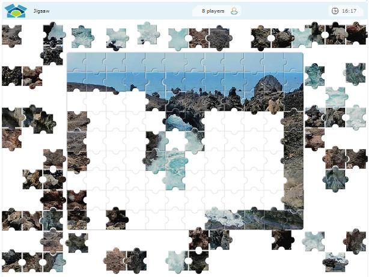
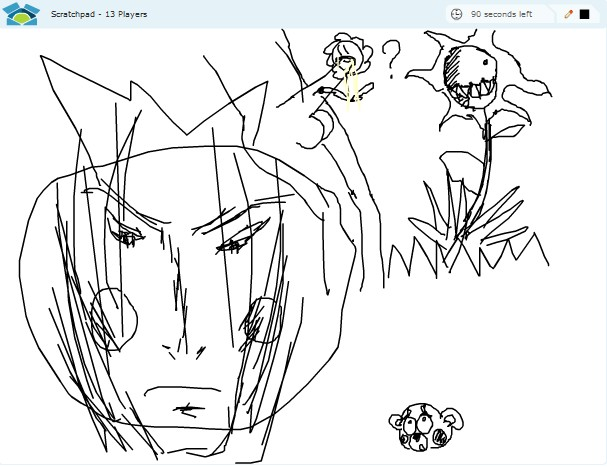

发现一个超级好玩的多人在线 Flash 小游戏网站。结果玩了2个多小时。第一个游戏就是“字母”。屏幕上有一堆堆的字母，你可以挪动这些字母，你可以用鼠标拖动字母来组成单词、句子或图形，同样在一个房间里的人可能会跟你抢字母。十分有趣。

===

有人明白你的意图时候可能帮你，有人则喜欢捣乱。

场面一片混乱。然后有个家伙坚持把字母排序，得到了大家的响应。

哈哈，虽然没有对齐，不过这么陌生人完成了这一杰作也是很不容易啊。那个家伙最后还尝试对齐，但是其他人一看排好位置了，各取所需，开始抢字母了。

很好玩吧，<a href="http://lunchtimers.com/" target="_blank" title="开始玩游戏！">地址在此</a>！

这个网站还有其他的游戏，也是一样有意思。

__在线拼图__：同样是多人在线完成，20分钟一局。

地址：[简单](http://lunchtimers.com/game/?game=jigsaw&roomid=easy)|<a href="http://lunchtimers.com/game/?game=jigsaw&roomid=medium" target="_blank">中等</a>|<a href="http://lunchtimers.com/game/?game=jigsaw&roomid=hard" target="_blank">困难</a>

__在线涂鸦__：3分钟清空一次画板，右上角可以选颜色。看一下别人的作品。

地址：<a href="http://lunchtimers.com/game/?game=scratchpad&roomid=room1" target="_blank">房间1</a>|<a href="http://lunchtimers.com/game/?game=scratchpad&roomid=room2" target="_blank">房间2</a>|<a href="http://lunchtimers.com/game/?game=scratchpad&roomid=room3" target="_blank">房间3</a>

其他的游戏就不介绍了，自己点上面的菜单去探索吧。

嘿嘿，最后来张“海报”！

另外，如果你有 Google账号、Twitter账号、OpenID……欢迎加入本站 GFC （右侧边栏点 Join）！ 暂时已经撤下
