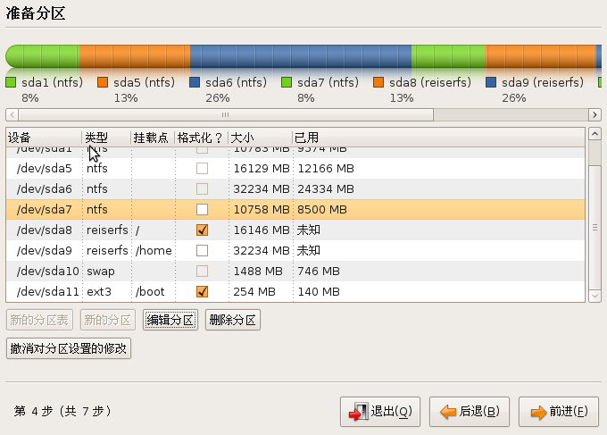
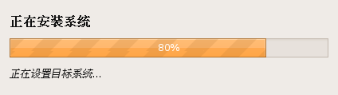

Because of some reasons, I finally divide to restall Ubuntu 8.10 , but my CD-rom&nbsp; does not work just the moment. So, I have to "Intall Ubuntu 8.10 in Ubuntu 8.10 from iso in disk" . But, there is a problem when the Intaller asks us to part the disk. Em,&nbsp; then I find something helpful here :

>  <a href="http://www.redbots.cn/ubuntu/2008/11/05/3482.htm" target="_blank">http://www.redbots.cn/ubuntu/2008/11/05/3482.htm</a>

===

It says, that is suit to __alternate __iso, but I also achieve with desktop iso.

Now, the installer is running, and I can sail on the web, the ubuntu live cd is magical, isn't it ?

_Some pictures druing installing:_

Why I speak in English now is that I can't type in Chinese, but it doesn't matter, though my English is poor.

To be continued ...

－－－－－－－11月17日 18:35 更新－－－－－－－

请注意第一张截图，我没有挂载 swap 分区，只是顺手给格式化了。因为我的 iso 文件就是放在这个分区里的，在重新安装之前我把这个区格式化为 fat32 了，当然其他格式比如 ext3 也可以。当从硬盘启动 livecd 之后，要把挂载 iso 的区给卸了，正如上面给出的链接上的页面所说，如果不卸载这个区，会出现安装到分区过程时显示空白的问题。

那么，安装之后，进入新的系统，做些必要的操作比如修改源、更新之类的事之后，就可以参考 <a href="https://dallas.lu/auto-mount-swap-in-ubuntu/" target="_self" title="自动挂载交换分区">这篇文章</a> 来搞定 Swap 分区。

呃，我现在使用起来很爽，之前的系统因为一再升级，累计的毛病我都懒得去弄，嘿嘿，都是自己胡乱搞东西的后遗症。把 `/home` 挂载到单独的分区真是爽哈～
