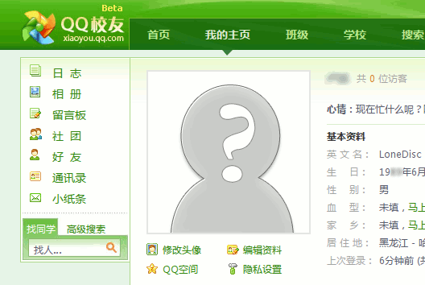
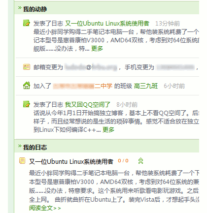

今天收到了一个高中同学的QQ校友邀请，此前曾经想过去体验QQ校友，但是一看要实名就赶紧关掉了。不过今天接受邀请的QQ本来就打算当作实名QQ来和老朋友们联系，所以还是进去体验了一下。

===

体验一小番之后，不得不说，校友很强大。中国的其他SNS，你们准备好了么？

QQ校友的界面，典型的SNS风格。

最近GR里尽是有关SNS和博客的争论，以及对SNS的探讨。又想起了一句话，中国的互联网公司到最后都是和百度、腾讯在竞争。腾讯的强项在于模仿。之所以说模仿是强项，是因为最后成功的往往是腾讯。

不懂SNS所涉及的什么什么市场、什么什么营销。但是单从校友的程序上来看，应该不比其他的程序差。最近热门的就是FaceBook和校内的开放API。这个目前还没看到腾讯有什么迹象。

记得有个说法是“WebOS”，也不排除校友成熟之后会有这个发展趋势的可能性。

我之所以说校友强大，是因为目前很为流行的SNS程序UCH。从功能上来讲，校友完全超越了UCH。靠的就是腾讯自己的地位、产品。

好吧，看看校友的“我的动静”、“我的日志”。而与此同时很多人为UCH中日志与话题之间的矛盾争论不休。看看校友的模式。

“我的日志”就是QQ空间里的文章，校园论坛就是Q吧；迷你博客是滔滔，相册……就是QQ相册；而且还有绑定整合的即时通讯群组——QQ群……腾讯的产品线的确很长，但是在QQ校友里，这些服务统统走到了一起。也正是这些服务，SNS不再是一个个孤岛，而是QQ校友这一片新大陆。

QQ校友可能成为既QQ邮箱之后的另外一个优秀的服务。

回想起去年玩校内的时候，发现校内从SNS起家，做的内容越来越大。甚至还发布了一个IM工具——校内通。让无比混乱的IM市场又添了新丁。那么，QQ校友呢，腾讯什么都作了最后才来作SNS，作大学生社区，或者说是大学生的社交工具。

在互联网上各种服务无法做到互通之前，腾讯极有可能是最后的赢家。SNS最后的竞争对手可能就是腾讯。
