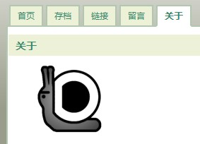

如何使用 CSS 来使导航栏呈现选项卡样式。

===

以下图效果为例。



每个菜单项均有上、左、右3个边框，整个菜单栏设置底边框；而菜单下面的内容，没有上边框。

CSS 如下：

```css
.menubar {
	width:640px;
	float:left;
	border-bottom:2px solid #b1c7b0;
}
.menubar li {
	float:left;
	list-style:none;
	background:#edf1d8;
	border:2px solid #b1c7b0;
	border-bottom:none;
	margin-left:4px;
}
.menubar li a {
	display:block;
	text-decoration:none;
	padding:5px 10px;
}
.menubar li a:hover {
	background:#fff;
}
.menubar .current_page_item {
	margin-bottom:-2px;
	background:#FFF;
	font-weight:bold;
	margin-left:4px;
	border-bottom:2px solid #fff;
	position:relative; /* for the fucking IE6 */
}
```

文章内容部分 #main CSS 如下：

```css
#main {
	width:636px;
	float:left;
	background:#FFF;
	background:#fff;
	border:2px solid #b1c7b0;
	border-top:none;
}
```

网页中使用类似结构即可：

```html
<div class="menubar">
	<ul>
		<li class="page_item">首页</li>
		<li class="current_page_item">关于</li>
	</ul>
</div>
```

<del datetime="2008-12-08T14:53:43+00:00">不支持 IE6。</del>

------------------更新------------------

之所以说不支持 IE6 ，是因为涉及到负边距的问题，上面的代码已经修改。感谢 [nipao](https://dallas.lu/tabs-with-css/#comment-252) 同学的激励~，关于负边距可以参考下<a href="http://www.codebit.cn/pub/html/xhtml_css/tip/negative_margin/" target="_blank">这里</a>。
