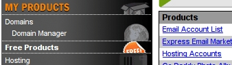

相信很多人都考虑过把博客图片拿出去托管。原因是放在自己的博客空间上很占流量，而且搬家也不方便。曾经，Yopoo 是不收费的，tu.6.cn 是可以上传的，很多网站是可以外链的……好吧，现在有个新的方案，用 Godaddy 的免费主机当作自己的图片服务器。

===

其实早就想写这篇文章，昨天看见 AG 同学也介绍了，正好考完 CET4 有点时间，所以就把只有标题的草稿拖出来了。

## Godaddy 相关业务扫盲

Godaddy 是全球第一域名注册商，开展主机业务以来也是颇受欢迎。目前提供三种型号的普通虚拟主机：

1.   Economy Plan：10G空间，300G流量／月；
2.   Deluxe Plan：150G空间，300G流量／月；
3.   Unlimited Plan：无限空间，无限流量。

在这里注册域名之后可以得到 Economy Plan 的免费版本。与收费的 Economy Plan 的差别在于：

1.   必须绑定一个在 Godaddy 注册的域名作为主域名，且不可更改；
2.   其他域名不能帮定到子目录，即只能做一个网站；
3.   在网页顶部强制添加广告。

其他配置，如空间和流量一模一样。

## $0.99 注册域名

既然我们只拿来用做图片服务器，为了这个空间买个贵米有点不值当。所以推荐目前 Godaddy 正在优惠的 info 域名。售价 $.99，另加 $0.2 的税，随便<a href="http://www.google.com/search?source=ig&hl=zh-CN&rlz=1G1GGLQ_ZH-CNCN307&=&q=godaddy+coupon&btnG=Google+%E6%90%9C%E7%B4%A2&meta=lr%3D" target="_blank" title="通过 Google 来搜索">找个 Godaddy 优惠券</a>就可以得到优惠，最后价格仅仅一美元多一点。

<h3 style="padding-left: 30px">注册</h3>

直接到<a href="http://www.godaddy.com" target="_blank"> Godaddy 首页</a>，查询域名是否被注册，后缀选 .info 。

英文一般水平就都能看懂，够选好域名就到下面找 Checkout 按钮，到下个页面点击 Continue to checkout；接着是填写一堆资料，如果我们用这个域名来使用 Godaddy 的主机，域名信息是可以隐藏的，放心填写。注意不要选其他的产品，我们的目标是 checkout；还有注册年份选择一年。

到清算页面，会给你列出你的要购买的产品和价格，输入你的优惠码吧，“If you have a promo or source code enter it here:**”这句话之后。提交后就会更新你的价格。

<h3 style="padding-left: 30px">支付</h3>

强烈不推荐用信用卡支付，很有可能你会被莫名其妙的扣钱。如果你有 Paypal ，直接付款就是。推荐选择 Gift Card 方式。至于Gift Card，你可以<a href="http://p.alimama.com/cpsglist.php?q=&u=276400&pid=mm_10606648_0_0&d=472929&str=1228211390&m=33" target="_blank">到淘宝上去买</a>，价格一般都以当前汇率为准，面额可以精确到美分，拍前和掌柜联系下就好。一般情况拍下 30分钟内卡号就会发到你的邮箱里（记得告诉掌柜你的邮箱），Gift Card 是没有密码的，谁知道卡号都可以用。

得到卡号之后，支付方式选择 Gift Card ，然后在右边输入卡号就 OK 了，域名到手。

## 申请免费主机

Free Products -> Hosting Accounts

接着点 Use Credit 。网页右边会有选项提示你使用哪个域名来申请免费主机，以及操作系统。建议选择 Linux ，如果日后你有需要使用 asp 程序，可以随时切换到 Windows 。继续填写一些资料，记得在填写管理用户名和密码的时候，密码要求很 BT，不能包含用户名，至少8位，必须同时有大写字母、小写字母、数字。然后就是等待了，大概需要10到30分钟。

这个域名仅仅算是临时的吧，我想你不会为个免费主机而花大价钱给它续费吧。进入主机管理，在 Setting->Domains ，绑定你的一个当前域名的二级域名过去，当然你也可以再别处把二级域名重定向到这个新域名上。

## 图片服务器

该怎么用这个有10G空间的虚拟主机作图片服务器呢？

<h3 style="padding-left: 30px">第三方博客工具</h3>

如果你用 Windows Live Writer 、菊子曰之类的工具来写博客，那就很方便了，可以直接以 FTP 方式把文件传到服务器上。

<h3 style="padding-left: 30px">网页上传</h3>

这个最好用图片管理程序，虽说不及专业图片托管商来得强大，但是可以有批量上传、文件管理之类的功能。down.chinaz.com/class/5_1.htm ，到这里挑一个程序吧。或者看 <a href="http://www.allengao.com/blog/godaddy-free-web-hosting-imagehosting-subdomain.html" target="_blank">AG 推荐的程序</a>。不知道 WordPress 有没有附件以 FTP 方式直接传到服务器上的插件？Discuz 论坛很久之前就有这个功能了。

<h3 style="padding-left: 30px">广告</h3>

至于广告的问题，既然是自己用，就忍一忍吧。去掉广告可能会被删除账号之类的，自己斟酌。提供两个方法：

1.在网页结尾添加 &lt;noscript&gt; ，这样插广告的 JS 代码就不会执行；这招很有效也很危险。

2.在网页 head 标签内添加 &lt;style type="text/css"&gt;#conash3D0{display:none;}&lt;/style&gt;，这个 conash3D0 是引入广告的框架 ID ，你也可以设置下宽和高，然后搞一个负 margin 把它稿页面外面去 。

## 总结

花费金钱8 RMB 左右，时间一个小时，就拥有了一个自己的图片服务器。可以外链，不限制图片大小，不会被和谐，不会被加水印打广告……

最后提醒一下，文件和附件一样重要，最好在本地建个文件夹，按服务器上的文件结构备份附件，因为《<a href="http://www.oioq.cn/articles/picture-backup.html" target="_blank" title="小O同学的经历">鸡蛋不要放在一个篮子里</a>》。
