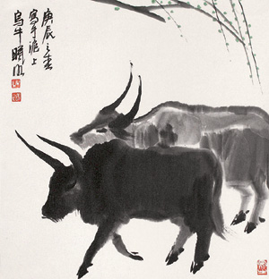

不知道是谁发明了一句祝福语：“Happy Niu Year !”意指大家经过惨淡的2008年之后，在2009年都能牛起来。但是最近两天，这句话被很多人引用，几乎在总结2008、展望2009的文章中都能看到。告诉大家一个不幸的消息：现在仍然是鼠年！

===

尽管人家也是出于美好的愿望，有着纯洁的动机……但我还是要科普（XXX：不就是显摆嘛）一下。

“生肖”是中国的特有文化，与农历、节气是分不开的。所以了解点农历的人至少知道牛年应该从农历新年算起。

过了春节之后，才是己丑年。严格地讲，生肖也不以春节为准的，而是从二十四节气中的立春开始算。

己丑年的正月初一是公历2009年1月26日，立春是2009年2月3日。所以，直到2个月后牛年才真正到来。

更多请参考：<a href="http://baike.baidu.com/view/13672.htm#2" target="_blank">百度百科－生肖</a>

2008年的确让我们变得胆小如鼠，对牛气的2009期待不已。

但为了您的光辉形象，请少安毋躁，不必急着“Happy Niu Year”，否则岂不牛头不对马面了么。

各位，元旦快乐！Happy New Year！新年おめでとうございます！
