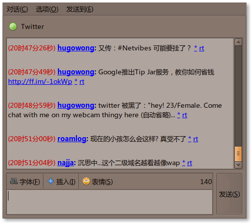

上次介绍 Pidgin 的时候，说到 Twitter 。我使用过的那个插件主页已经挂了。现在又有了新的选择，Microblog-purple 刚刚在前几日更新了。各位 IM 控，这个插件十分不错。特推荐之。

===

正如这个插件的名字，它还支持 <a href="http://identi.ca/" target="_blank">Identi</a> 等其他微博客。不过最适合 [Twitter](https://twitter.com/dallaslu) 。

好吧，先来看看效果如何：

看，点击用户名是 ＠ 回复，＊是收藏，rt 是重新发布。没有 Twhirl/TweetDeck 等客户端那么强大，甚至连 TwitterFox 的切换回复和消息的功能都没有。但是在聊天软件中推，又是另一番感觉。长链接自用使用 tinyurl.com 压缩（这个不是 Twitter 自有的功能吧？），支持 HTTPS 方式获取数据。

如果你对 <a href="https://dallas.lu/kiss-the-sexy-pidgin/" title="玩转Pidgin">Pidgin</a> 和 Twitter 都感兴趣，就来安装体验吧！

## 安装插件

<a href="http://code.google.com/p/microblog-purple/downloads/list" target="_blank">Microblog-purple项目主页</a>，当前版本 0.2.1 。

<h3 style="padding-left: 30px;">Windows</h3>

<a href="http://microblog-purple.googlecode.com/files/pidgin-microblog-0.2.1.exe" target="_blank">pidgin-microblog-0.2.1.exe</a>

下载 ，运行安装即可。

<h3 style="padding-left: 30px;">Ubuntu</h3>

打开 <strong>应用程序>附件>终端</strong>，执行命令 <code>sudo gedit /etc/apt/sources.list</code>。

按你的系统版本将以下文本复制到 sources.list 末尾。

<h4 style="padding-left: 60px;">Ubuntu 8.04</h4>

<code>deb http://ppa.launchpad.net/sugree/ppa/ubuntu hardy main #Pidgin-Microblog</code>

<h4 style="padding-left: 60px;">Ubuntu 8.10</h4>

<code>deb http://ppa.launchpad.net/sugree/ppa/ubuntu intrepid main #Pidgin-Microblog</code>

<h4 style="padding-left: 60px;">Ubuntu 9.04</h4>

<code>deb http://ppa.launchpad.net/sugree/ppa/ubuntu jaunty main #Pidgin-Microblog</code>

保存文件。依此执行命令

<code>sudo apt-key adv --recv-keys --keyserver keyserver.ubuntu.com 0CF459B8DF37ED8B</code>

<code>sudo apt-get update</code>

<code>sudo apt-get install pidgin-microblog</code>

OK。是不是感觉麻烦？软件源机制能够很方便的升级软件，一劳永逸。

<a href="http://ppa.launchpad.net/sugree/ppa/ubuntu/pool/main/m/mbpurple/" target="_blank">相关 deb 安装包</a>

够懒的话,直接下载吧。

## 配置插件

打开 __Pidgin>工具>插件__，找到 __Twitgin__ ，启用之。

打开 __Pidgin>账户>管理账户>添加__，协议选择 __TwitterIM__ ，高级选项卡中可设置刷新时间。

-----------------------------------

好了，享受一下成功的喜悦吧，推几条试试！这个插件还支持命令哦！

<table>
<tbody>
<tr>
<th>发送指令</th>
<th>功能</th>
</tr>
<tr>
<td><code>/replies</code></td>
<td>获取回复</td>
</tr>
<tr>
<td><code>/refresh</code></td>
<td>立刻刷新</td>
</tr>
<tr>
<td><code>/tag #xxx</code></td>
<td>为每一推前面加上 #xxx</td>
</tr>
<tr>
<td><code>/btag #xxx</code></td>
<td>为每一推后面加上 #xxx</td>
</tr>
<tr>
<td><code>/untag</code></td>
<td>取消 tag</td>
</tr>
<tr>
<td><code>/replies</code></td>
<td>立刻刷新</td>
</tr>
</tbody>
</table>

其实这个 tag 功能倒是瞒有意思的，扩展下思路，用 Pidgin 默认带的__文本替换__插件，来对一些关键词诸如 Google/GFW 等自动打上标签。

几天下来的使用，让我关注推特的时间大大延长。真不知道是好事还是坏事，你觉得呢？
