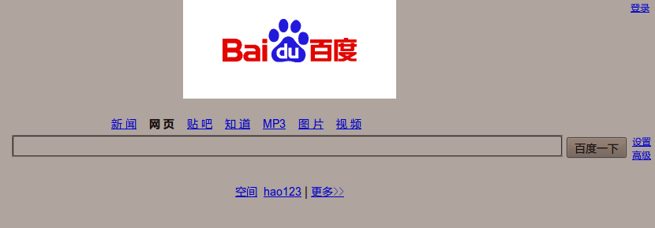

很多人都不大可能注意到这个细节，包括我也是。直到我长时间地使用一款深色主题。我刚发现的时候，只是在Twitter上牢骚了一下。但是这种没有设定背景颜色的网站实在是太多了。

===

多数网站都喜欢用白色背景。尽管白底＋蓝字的风格符合网民的浏览习惯，甚至是传统——但，我偏偏不太愿意看到这个浪费显示器电能，又毫无新意的设计，尤其是蓝字链接默认带下划线的。

正因为厌倦了白底黑字和黑底白字，所以我动手修改了一下 Ubuntu 自带的深色主题配色。明显的好处是，使用软件时，我能够把注意力集中在文本上，而不是被整个屏幕的白花花的颜色所影响。问题来了， FireFox 默认使用了系统的颜色方案，所以我经常面对这样的网页：

不错，正是百度首页。

尽管 Google 在首页上考虑得周全一点，但是在 Google 翻译上依旧如此。

再比如，NetPuter 同学的博客。

类似的还有鲜果的个人页面等等等等。

当然，这么设计是没有错的。因为 99.99% 的浏览器的默认背景都是白色，据我估计。从百度的 Logo 背景、NetPuter 的右侧栏广告背景来看，他们的本意是背景为白色；从 Google 的两个页面来看，明显 Google 翻译 是个疏忽。

尽管我知道，修改下 FireFox 的颜色方案，把默认背景改为白色就解决了这个问题。但是：

<strong>既然你认为你的背景应该是白色，为什么不在 CSS 中指定一下呢？</strong>

<strong>只需要在 CSS 中加上一句：background:#FFF !</strong>

又发了一遍牢骚。不过我依然使用着深色背景的浏览器四处游逛——如果网页的文本颜色和图片背景不是很浅的话，这样看起来还是挺舒服的。
