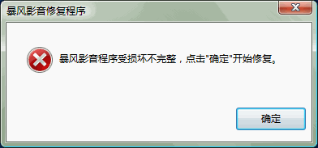

且不谈网络故障与暴风有多大干系，暴风影音依然是我电脑上最流氓的软件。请允许我，代表我硬盘上的所有文件夹，鄙视一下 “D:\Program Files\StormII ” 这个目录。

===

很久之前经别人推荐使，我开始用暴风影音。这玩意儿连我电脑上一个稀奇古怪格式的视频都能播放。使用简单，界面爽快，速度流畅。我也乐于推荐给其他人使用。

但这个软件越来越流氓。去年年末看到新版本，死活没升级。早已经开始对其斑斑劣迹不满了。

## 后台服务

一个播放器，需要添加到系统服务吗？这个服务能帮助用户获得更好的观看体验吗？

尝试干掉暴风的后台服务，遂删除了 `stormliv.exe`。再次启动暴风的时候：

确定吧，刚才干掉的文件又杀回来了。修改属性、权限都不行。再后来，不知怎地，这个服务莫名地在我的电脑上消失了。

## 广告

## 迷你首页

天啊。QQ有，迅雷有，全都有。

就不再举例了。当我怀着崇高的革命热情打开《地道战》，暴风给我推送的就是这么些玩意儿。
