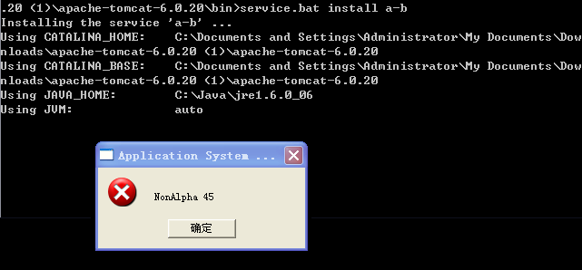

时间像撇条一样汩汩延绵，正当你畅快淋漓之后、意犹未尽之时，无奈地发现手里只剩下烟屁股了。转眼两月没有更新，实在是有话难说、欲语无言。

===

近几日碰见了几个让人感到凄凉的问题。

## Tomcat 安装服务

Tomcat 非安装版，有个 service.bat 可以用于安装 Tomcat 为 Window 系统服务。可世事太他妈无常了，楞是出个对话框说：NonAlpha 45。

Google 来一篇文章，好像是来源于邮件存档。为找出“NonAlpha 45”的原因，此文详细地解释了 service.bat 的工作机制、实现原理。看得我莫名惆怅。

其中各种辛苦求证不必再表，反正最后发现是这么回事：

service.bat install a-b 这条命令的问题在于，<strong>tomcat 的服务名不能有“-”</strong>！

## Openfire 管理密码

出于某种邪恶的企图，我怀着不纯的动机安装了 openfire 。让人困惑的是，刚刚设置好的密码竟然不好使！

更换数据库、清空加密后的密码等等等等完全无效。最后，一个忘了什么名字的论坛的某个帖子的一个回复，一语惊醒梦中人：

<strong>重启 openfire</strong>

瞧瞧，这就是生活开的凄凉的玩笑。妈的，浪费我的时间。
