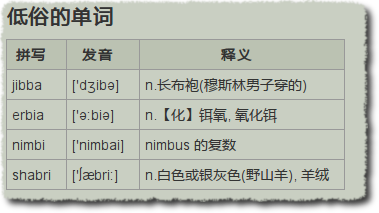

订阅的200个博客里面，我没注意到谁使用过表格。的确，表格不适合用来做页面布局了。但是，本来可以用表格直观表述的内容，干嘛都还包含在段落标签里呢？

===

难道没人打算使用表格了吗？我随便打开了几个关注的博客，去查看他们的 CSS 。基本上都为表格指定了样式，尤其是 [iNove](http://www.neoease.com/inove)，不愧是“现象级的模板”（via [Bolo](http://www.neoease.com/wordpress-searchbox-tip/#comment-12673)），真够细致的。

我喜欢对发表过的内容删删改改。某次曾对多篇文章重新排版，分段，外加小标题。最近又曾给所有下载和提示都加上背景。

上段时间写完《[低俗的英语](https://dallas.lu/jibba-erbia-nimbi-shabri-sougou/)》，翻看《[Pidgin 上玩 Twitter](https://dallas.lu/be-a-twitter-on-pidgin/)》的时候，发现其中几段文字实在是太乱了。我没有精力也不热衷给段话都配上一张有趣的，哪怕是毫不相关的图片；但是话说不清楚，字看不明白，真是一件让人恼火的事情。

看一下上面的例子，是不是要比用 4 个 br/ li / p 要好的多呢？

那我为什么就没看到有人使用表格呢？

## 原因一：WordPress 编辑器没有插入表格按钮

不是谁都喜欢工作在 HTML 编辑模式下，打一坨 tr td 标签也挺繁琐。一些相关的插件也很久没有更新了。

## 原因二：宁愿使用列表

列表是一维的，表格是二维的，其表述能力自然不同。但是表格的样式处理问题惹怒了不少人。现在一提到网页制作，会有很多人跳出来说千万别用表格，DIV+CSS 无所不能。

## 原因三：Feed 中并不输出样式

这就要看阅读器的默认样式了。如果没有设定 border 那很难直观地看出来了。而这样也消弱了表格展示数据相关性的强项。

————————————————————————————————

而实际上，表格用起来很简单很爽快。添加个“插入表格”按钮，给表格写段 CSS，在 Feed 中输出样式，都很好解决。

你在写博客的时候，用过表格吗？
