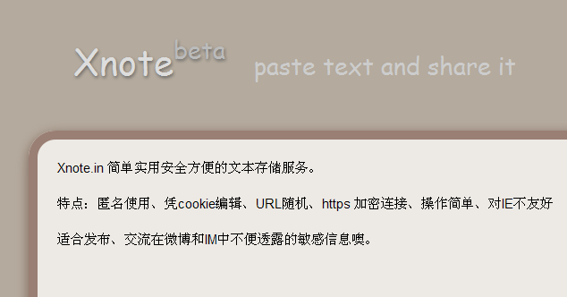

无聊之际，想起来很久以前想过做个类似 tinypaste.com 的服务，加之又看见 notepad.cc 受了刺激，忙里偷闲两天做了个Xnote出来。由于界面不是很难看，先上截图。

===

## 简介

好，先说下截图中的文本( <https://xnote.in/about>)。
>  Xnote.in 简单实用安全方便的文本存储服务。特点：匿名使用、凭cookie编辑、URL随机、https 加密连接、操作简单、对IE不友好。

## 使用帮助

听起来很酷吧。使用起来很方便的，前提是，得看下帮助(<https://xnote.in/help>)。
>  访问主页，或直接在地址栏中敲入期望的路径，打开页面后写入文本，从地址栏中复制路径并通过微博、IM发布即可。
就是这样，没有多余的步骤。是的，是自动保存的。只要你的 cookie 还在的话，可以随时访问这个地址进行编辑修改，消灭证据。:)

## 开源

update at 2010-11-17 ：竟然有人要源码，我好兴奋。<a href="https://code.google.com/p/xnote-php/" target="_blank">https://code.google.com/p/xnote-php/</a>
