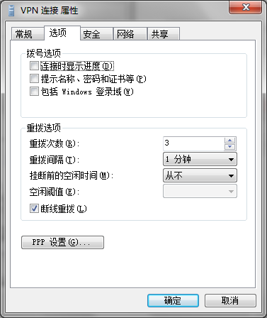

现在的网络环境真是糟糕，随便在 Google 搜索点什么都有可能被重置连接，完全无规律可循，敏感词的字典越来越厚，都快背不下来了。所以长时间连接VPN就越来越有必要。加上永久路由表，不影响访问国内网络服务，感觉真是一夜回到“解放”前哪。

===

## 自动连接VPN

使用你从供应商处获取的地址、用户名和密码，创建好一个VPN连接，并选择记住密码。修改该连接属性，在“选项”中取消“显示连接进度”和“提示名称密码和证书”前面的复选框的勾选：

在开始菜单中的“所有程序”目录中的“启动”文件夹上右键，选择“浏览”来打开资源管理器窗口。在该窗口中右键，新建一个快捷方式，在对象的位置中输入：

`rasphone -d "VPN 连接"`

引号中内容应与连接名称一致。单击下一步完成即可。双击该快捷方式，看看能否正常工作。下次登陆或启动系统时，这个快捷方式将为你自动拨号。

## 永久路由表

1.   首先[下载路由表脚本](https://chnroutes-dl.appspot.com/)
2.   解压，使用文本编辑器编辑其中的 vpnup.bat，将 'route add' 全部替换为 'route -p add'
3.   双击该文件，等待其执行完毕自动关闭
4.   访问 ip168.com 和 whatismyip.org，如果两个网站检测出的IP一个在中国一个在美国，那就正确了。

（以上方法仅适用于 Windows 操作系统）
