众所周知，黑莓在天朝是没有App Store服务的，所以勤劳和智慧的天朝子民创作了黑莓之翼（BerryWings）这款应用于黑莓手机的程序，可以通过手机下载自己喜欢的程序。而且，全部免费。（下面“黑莓之翼”简称为“翅膀”）

===

该程序的LOGO是字母“W”，而且还是个断翅的“W”，不知有和深意。请看下图：

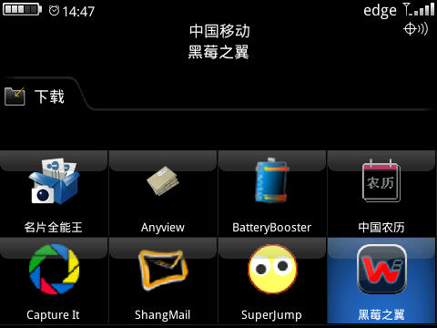

接下来是进入程序，顺便说一句，笔者的BB型号是9530：

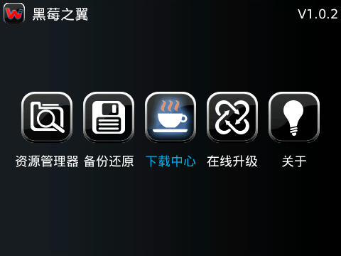

进入程序后有几个相应的选项，下面我们从第一个开始资源管理器开始看：

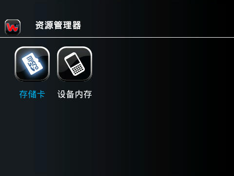

其次是翅膀的第二大功能，数据的备份还原，这个是很多莓友喜欢的功能，随时备份自己的电话本，不会像链接电脑使用DM那样复杂：

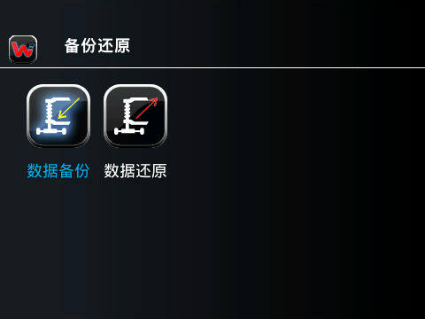

备份的的种类也很全，笔者只备份电话本：

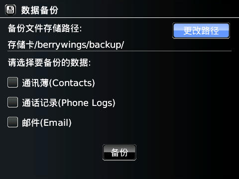

接下来就是翅膀的重要功能，程序下载：

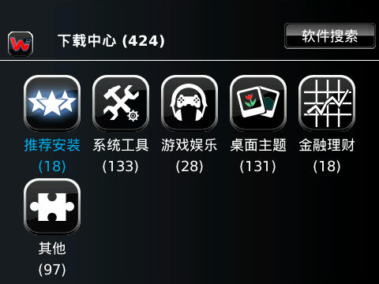

先进入到推荐安装，看，都是免费的程序：

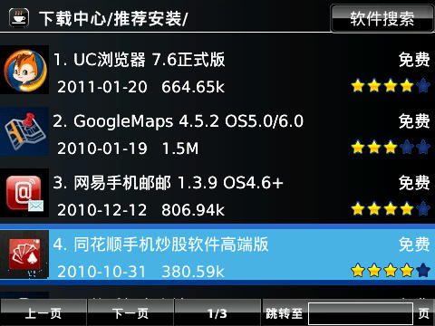

还可以查看该程序的详细信息，决定是否下载：

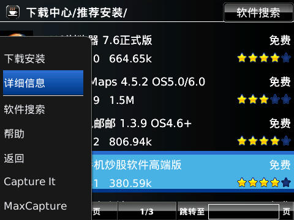

系统工具是下载中心里程序最全的地方，很多实用的应用程序可以在此下载，而且还对应你的手机型号：

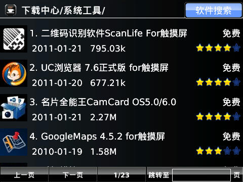

下载中心的其余几个模块在此不一一介绍了。翅膀还有个软件搜索功能：

笔者搜索了一下“手机”，请看搜索结果：

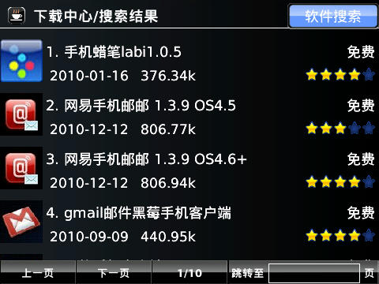

下面是演示如何下载工具：

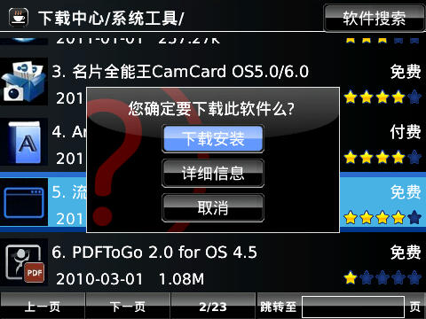

点击下载安装会自动跳到手机自带的浏览器，切忌要用sb激活，否则自带浏览器无法使用：

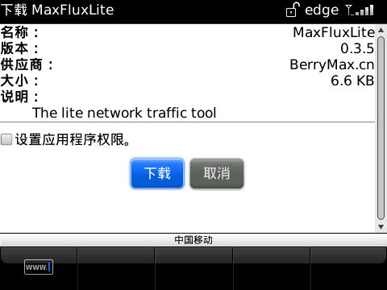

点击下载后，手机自动进行下载安装：

结束后：

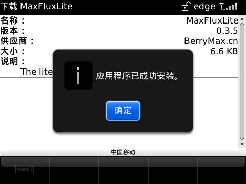

最后，退出翅膀：

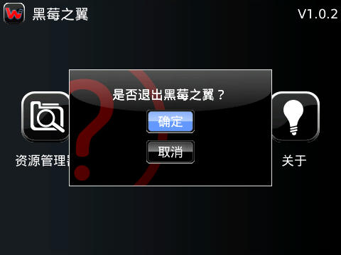

 使用翅膀可以在没有电脑的情况下随意下载应用，也可以免去手机连接电脑，打开DM，安装程序，重启激活的麻烦。之前在手机论坛找到的《全能名片王》，安装在BB里不好使，就删除了。这次用翅膀下载并安装的不仅速度很快，而且好用。

推荐每位莓友安装黑莓之翼，玩转自己的黑莓！