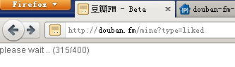
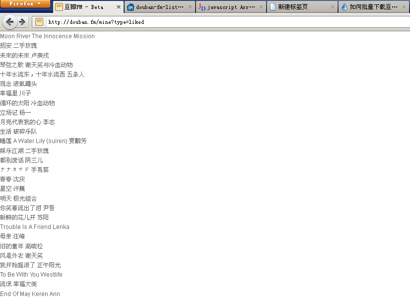

最近网络状况不怎么好，所以听豆瓣电台时，总会一顿一顿的，好好的歌曲挺起来就跟DJ版说唱乐似的。在小众软件上[看到一个办法](http://www.appinn.com/how-to-download-douban-fm-fav-music/)但是太过麻烦，但是[INK同学的提出的思路](http://www.appinn.com/how-to-download-douban-fm-fav-music/#comment-88779)倒是不错。

===

花了一段时间最后写了这个JS脚本。使用方法如下：
<ol>
    <li>将下面的链接存为浏览器书签，可直接拖拽到浏览器的书签栏中：
<a href="javascript:(function(j){var s= document.createElement('script');s.type ='text/javascript';s.src=j;document.getElementsByTagName('head')[0].appendChild(s);})('https:/'+'/douban-fm-list.googlecode.com/svn/trunk/douban-fm-list.js');">导出豆瓣电台喜欢歌曲</a></li>
    <li>登陆豆瓣电台，打开“<a href="http://douban.fm/mine?type=liked" target="_blank">加红心**首</a> ”页面。</li>
    <li>点击刚才收藏的书签，直到执行完毕</li>
</ol>

导出的列表文件如下：

全选复制保存即可。这里看到的歌曲列表可能要比豆瓣电台显示的要少，是因为存在重复歌曲（歌曲名和艺术家完全一致）。

至此，豆瓣电台标记为喜欢的歌曲就导出完毕了。如果你需要进一步的操作，可以Google：mp3 批量搜索下载。
