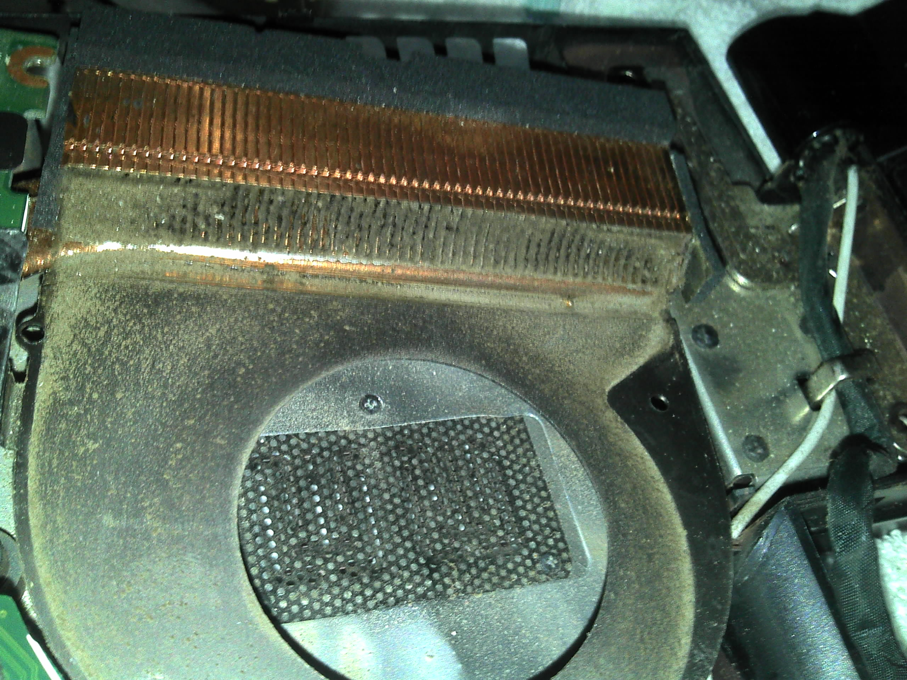

我的笔记本 V370 已经使用了[一年多](https://dallas.lu/lenovo-v370/ "Lenovo v370")，最近发热特别厉害，甚至蓝屏、死机。尽管哈尔滨外面零下20多度，室内20度，笔记本仍然发烧不止，呼吸不畅。这次开机不到5分钟，便蜂鸣着死机了，找到网友在一年前发表的[拆机过程](http://itbbs.pconline.com.cn/notebook/14678079.html)图，开始动手拆机。却发现这教程讲的不太清楚，所以记下自己的拆机和清理过程。

===

## 准备工作

## 卸下D壳螺丝

拧松黄色圆圈所示位置的3颗螺丝，卸下挡板，即可看见挡板内部蓝色圆圈所示位置有2颗螺丝。加上红圈所示13颗，共计15颗长螺丝；拆下电池，可见电池仓内部蓝色圆圈所示位置有1颗短螺丝，全部卸下。

## 取下键盘

大概在左 Alt 和 右 Ctrl 的位置，有两个铁暗卡。所以要从键盘上面两个角开始撬开键盘。这个过程要小心，键盘本身与一块金属板是一体的，翘的时候不要弄坏键盘。

取下键盘后，卸下键盘的排线。不要用力，拨开黑色的塑料压片即可。

## 卸下C壳

键盘下有5颗标注M2的螺丝，全部卸下。再卸下视野内的5个排线。逐个拨开缝隙中的暗卡，即可卸下C壳，这需要一点耐心。

## 卸下主板

小心翻转，卸下硬盘旁的3颗固定螺丝，拉下硬盘。在主板上靠近触摸板的位置上，卸下一颗短螺丝。小心卸下连在主板上的视频、音箱、电源等连线。注意机身左侧的网卡接口、USB，小心地取下主板。将主板翻过来，就能看到风扇。

## 清理灰尘

卸下风扇上的4颗小螺丝，将电机和扇叶拿开，就能看见积攒的灰尘已经把出风口封死了。

用刷子等工具清理好风口和扇叶，工作就完成了。下面的工作就是小心地逐步将笔记本装好。所幸的是，我没有丢失一个螺丝，而且，最后也没有一个螺丝剩下来。开机后一切正常，现在正用 V370 写博客。

如果你决定也为你的 V370 降降火，请先确定人品是否足够，我可不做任何的担保。:)
