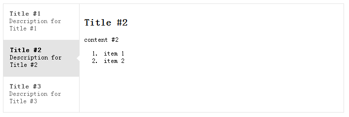

以一定结构组织 HTML，引入所需 JavaScript 脚本和 CSS样式文件，即可创建可切换的 Tab Show。

===

<a href="https://dallas.lu/files/2012/04/jstab.png"></a>



## 基础 HTML 结构

引入所需 `jstab.css`，`jstab.js`，`mini.min.js`，为外部 DIV 设定基本样式：

```html
<script src="mini.min.js" type="text/javascript"></script>
<script src="jstab.js" type="text/javascript"></script>
<script type="text/javascript">
	// ...
	jstab({
		"nav" : "#banner-tab-nav",
		"content" : "#banner-tab-content"
	});
	// ...
</script>
```

## 内容 HTML 结构

需要为导航和内容创建两个列表元素，并按如下结构组织内容：

```html
<ul class="jstab-nav-list" id="banner-tab-nav">
	<li class="jstab-nav-item jstab-nav-item-first jstab-nav-current-item">
		<div class="jstab-nav-label">
				<span class="jstab-nav-title">Title #1</span> <span class="jstab-nav-desc">Description for Title #1</span>
		</div>
	</li>
	<li class="jstab-nav-item">
		<div class="jstab-nav-label">
				<span class="jstab-nav-title">Title #2</span> <span class="jstab-nav-desc">Description for Title #2</span>
		</div>
	</li>
	<li class="jstab-nav-item jstab-nav-item-last">
		<div class="jstab-nav-label">
			<span class="jstab-nav-title">Title #3</span> <span class="jstab-nav-desc">Description for Title #3</span>
		</div>
	</li>
</ul>
<ul class="jstab-content-list" id="banner-tab-content">
	<li class="jstab-content-item jstab-content-current-item" id="banner-tab-content-1">
			<div class="jstab-content">
			
			content #1
			
			content #1
			
			</div>
	</li>
	<li class="jstab-content-item" id="banner-tab-content-2">
		<div class="jstab-content">
		
		content #2
		<ol>
			<li>item 1</li>
			<li>item 2</li>
		</ol>
		</div>
	</li>
	<li class="jstab-content-item" id="banner-tab-content-3">
		<div class="jstab-content">
		
		content #3
		
		</div>
	</li>
</ul>
```

其中，#banner-tab-nav 中的每一个 a 元素都指向其对应的 `.jstab-content-item` 元素。注意这两个列表的 ID 与下方 JavaScript 中对应。

## 样式调整

提供的 CSS 样式表中，有多处以 px 单位指定了绝对大小，请依实际情况逐个调整。

## 下载

包括代码和演示：[jstab](jstab.zip)
