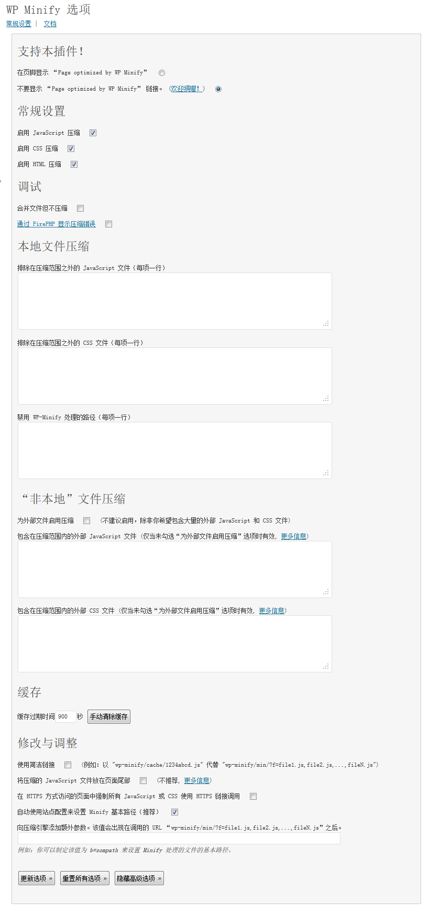

[加速 WordPress](https://dallas.lu/how-to-speed-up-wordpress/ "加速 WordPress") 的手段之一就是合并 JavaScript 和 CSS 文件，甚至使用 gzip 压缩，来减少浏览器的 http 请求耗时。但是通常情况下，我们只能通过手工的方式来干。但是当你启用或禁用了插件，更换了主题，不断的重新手动合并，噩梦就开始了。现在，你可以用插件 [WP-Minify](http://wordpress.org/extend/plugins/wp-minify/) 来自动完成这些工作了。

===

WP-Minify 能够自动整合插件和主题中的 JavaScript 和 CSS 文件，并可以使用 gzip 压缩输出。

## WP Minify 中文语言包

请下载语言文件，解压后放入 `wp-content/plugins/wp-minify/lang` 文件夹内即可。

[wp-minify-zh\_CN](./wp-minify-zh_CN.zip)
