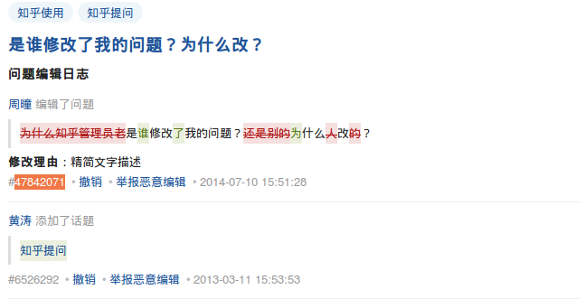

知乎已经成为获取知识和以获取知识为理由消磨时间拖延正经事儿的不二选择，尽管知乎上涌入了大量的各色用户，甚至不断有大神声明离开。既然是知识的集散地，那就不仅有精英到平民的方法论价值观输出，也应该有术业有专攻的散户的精彩回答。所以，希望知乎用户不必激进的认为「知乎被傻逼占领了」。

===

## 引用同问题下的其他回答

我们常在知乎上看到这样开头的回答：
>  
> 
> *   实名反对排名第一的答案。
> *   针对老张的答案做些补充。
> *   对楼上的回答不能苟同。
> 
>

他们可能是投票、邮件、论坛用多了，不知这里的答案显示顺序是会变化的。不是排名第一永远第一，并非所有的人都知道某人的昵称，没有楼上楼上。正确的方式：

先通过 @ 引入回答者的链接（在答案下方的编辑时间上右键->复制链接），或仅用文本「匿名用户」；贴入回答的链接；再把具体的观点以引用的格式贴在下面。然后再开始正式回答问题。

## 引用问题内容

知乎的问题是开放修改的，你回答了之后，问题可能会被修改的面目全非。如果你发现了这样的情况，或者为了预防这样的情况，可以通过右侧栏下方的「查看问题日志」来检查问题修改记录。

在引用问题时，加入一个手动构造的链接：
>  原问题（[https://www.zhihu.com/question/20329418/log\#r-6526292](https://www.zhihu.com/question/20329418/log#r-45044355)）提到「知乎管理员」修改了问题，实际上知乎是类 Wiki 的，谁都可以修改问题。

## 屏蔽一类问题

如果某些没有兴趣的问题一再出现在首页时间线上，可以先忍耐一下，访问问题页面，找到最能代表这类问题的「话题」，如「如何优雅地X」。

然后访问设置中的「屏蔽」页面。

把这个话题列入屏蔽。但是，仍有可能在时间线上出现同类的问题，不要慌张，忍耐一下，访问这个问题页面，通过问题标题上话题后的「修改」链接，为这个问题添加一个合适的、你已经屏蔽了的话题，理由可以写「增加话题，以供其他用户屏蔽」。这样不仅自己清净，同时造福他人。

## 新窗口打开动态中的答案

如果你和我一样，喜欢在首页动态先浏览一遍，先筛选感兴趣的答案再逐个阅读的话，记得要在答案后面的「查看全部」上右键新窗口打开，而不是问题标题。否则你在动态上看到的是：

点开了问题标题，看到的却是：

另外，对于有时效性的问题，可以通过鼠标悬浮在「按投票排序」上来选择按时间排序，可能会看到不同的看法。

## 勤用忽略、屏蔽和举报

在首页动态上，遇到不感兴趣的问题，最好随后点击右上部位的 X，来忽略它。顺便看一下因赞同、关注、回答了这个答案或问题而产生这条动态的用户，可以考虑屏蔽他/她。

与此同时，知乎不是一个言论自由的地方，自我审查一直存在，以及存在「友善度」这样一个可能用来遮掩审查的指标；所以不用太在意举报的后果，有合理的理由认为其不妥的答案都可以点举报。

## 结语

合适的输出，以及有选择的输入，可以建立起一个逻辑上的「知识圈」。这样人人都可以贡献肥料、汲取营养；通过「知识链」的建立，知乎就可以成为一个「没有傻逼」的知识<del>化粪池</del>生态圈。
