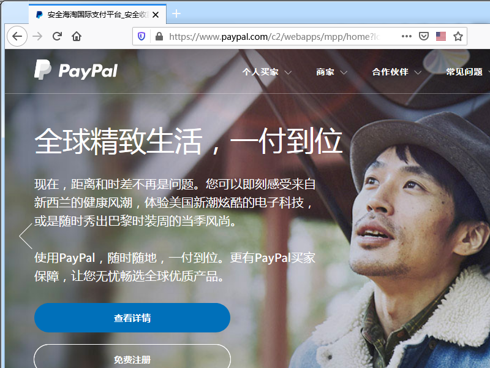

最新バージョンのFirefoxおよびChromeでは、EV証明書を使用してhttpsサイトにアクセスすると、緑色のロックアイコンと会社情報がアドレスバーに表示されません。代わりに、灰色のロックアイコンはDV証明書サイトと同じです。

===

今年の8月には、Firefoxは70.0バージョンが10月にリリースされたときに、EV証明書の特別な表示特典をキャンセルすると発表しました。理由は大まかに：

1.   追加の会社情報はユーザーを混乱させ、画面スペースを占有します。
2.   EV証明書がユーザーの認識に影響を与え、ユーザーが気付かないデフォルトのhttpsエクスペリエンスプロセスの進行を遅らせることを強調します。
3.   ユーザーはEV証明書のグリーンマークを気にせず、不正防止効果は重要ではありません。
4.   Safariは、昨年から会社情報を隠しています。

ただし、Safariよりも攻撃的であり、灰色のアイコンとして表示されます。このニュースは、証明書業界にとって大きなマイナスと見なされています。ブラウザのアドレスバーを緑色に変えると主張する主要なEV証明書ベンダーは、スキンを販売することを頭の中で1万語持っており、誰と話すことができるかわかりません。

ブラウザと証明書ベンダーの対立は古くからあり、Chrome証明書ベンダーにとっては初めてではありませんが、8月に証明書の有効期間を短縮することが提案され、却下されました。では、EV証明書は本当に不要なのでしょうか。

## EVとUIの設計

現在、ディスプレイの解像度が通常1920の場合、ブラウザのアドレスバーの幅は少なくとも1200ピクセルです。 Firefoxインターフェースでは、アドレスバーの前後に空白があります。左側にはプライバシーアイコンがあり、右側には読み取りモードとプラグインショートカットアイコンがあります。そんな空っぽのアドレスバー、「宝鸡有一群怀揣着梦想的少年相信在牛大叔的带领下会创造生命的奇迹网络科技有限公司{lang=zh-CN}」と言えば、こんなに長い社名は理にかなっていますが、「PayPal株式会社」ですら。 。 "" Apple Inc. "は手放せませんか？

もちろん、ブラウザは常に最大化されたウィンドウで実行されるとは限りません。Firefoxはアドレスバーをどのように処理しますか？ URLの一部を非表示にします...では、なぜ会社情報が同じ扱いを受けられないのでしょうか。手動でURLを入力することはほとんどない初心者ユーザーを見たことがあります。彼らは検索エンジンでキーワードを検索し、リンクをクリックしてWebサイトにアクセスします。これらの人々にとって、紛らわしいURLは役に立たず、複雑なボタンです。非表示にするだけで無駄です。これにより、画面スペースを大幅に節約できます。

モバイル版では、水平方向のスペースが実際に非常に制限されており、デフォルトではドメイン名のみが表示され、完全なURLはクリックした後にのみ表示されます。したがって、EV情報を2行に分割して、ドメイン名に表示することは難しくありません。

ユーザーは怠惰ですが、愚かではありません。会社情報は紛らわしく、問題はありません。最新バージョンのFirefoxでは、「証明書の発行先：PayPal Inc.」というあいまいな説明のみが表示され、混乱の原因となっています。会社情報をクリックすると、「XXXによって確認されました。このウェブサイトはPayPal Inc./Ownedによって運営されています」という文が表示され、愚か者はそれが何を意味するのかを知っています。

## EVと無意識のHTTPS

MozillaとGoogleは、知覚のないHTTPSは、あなたがEV / OV / DVであることを意味し、すべてが少し黒いロックを示していると考えています。結局のところ、知覚できないようにするために、彼らはすべてあえて`http://www` を隠します。知覚できないHTTPSも存在しない要件です。不安、伝送セキュリティ、および商用セキュリティを不安とセキュリティに還元することはできません。ブラウザはHTTPSプロモーションの障害にはなりません。ブラウザが黒のロックと緑のロックを区別できるかどうかによって、WebサイトがHTTPSを自動的にサポートすることはできません。

自治政府でさえ、髭剃り命令を実行するためには、ピグテールを残したくない人を殺すだけで十分であり、ピグテールの旗手でさえお金のラテイルで殺す必要はないことを知っていました。満州清王朝の兵士たちが、私たちが欲しいのは無感覚な編組だと言ったと想像してみてください。髪の毛が少なすぎて、他の人の編組の認識に影響を与えます。それを引き下げて切り刻んでください。

## EVと不正防止

ユーザーはEVを気にしません。これはブラウザや証明書ベンダーの問題であり、宣伝は弱いです。 HTTPSなど、ユーザーが気にしないことがたくさんあります。ユーザーは`https://` と入力するのが面倒で、業界はHTTPSをあきらめる代わりにHSTSプリロードを提案しました。

ユーザーは、WindowsドライバーとMac OSアプリのコード署名証明書を気にしません。署名情報を非表示にしてみませんか？申し訳ありませんが、これはMicrosoftとAppleのオペレーティングシステムの問題です。MozillaとGoogleはそれを管理できません。

一部のユーザーは、証明書の緑の意味に気づき始めたばかりであり、EVの廃止は不正防止に非常に役立ちます。メールを受信した場合は、「[`https://www.аpple.com`](https://www.аpple.com)"を使用すると、HTMLソースコードを表示できます。あえて開いてみませんか？これはAppleの公式ウェブサイトではありませんが、ご安心ください。これまでのところ、これは存在しないWebサイトです。 URLの`а`は通常の小文字ではありません。

Twitterの友達[@ViafaSia](https://twitter.com/ViafaSia/status/854051035580481536)も、Let’sEncryptメソッドのDV証明書とURL内のリンゴのすべての文字に合格したフィッシングウェブサイトを見つけました似たようなキャラクターです。もう1つ、<https://раураӏ.com>です。Firefoxで開いて、実際の[`https://paypal.com`](https://paypal.com ) ChromeはIDNドメイン名を別の方法で表示するため、MozillaがGoogleと一緒に立つことがいかに愚かであるかをご存知でしょう。

リンクの上にマウスを置いてブラウザのステータスバーに実際のURLを表示したり、HTTPSリンクであるかどうかに注意したりするなど、偽のリンクを識別するためのいくつかのトリックを習得した可能性があります。しかし、それでも高度なフィッシングWebサイトから逃れることはできません。

## EVとSafari

Safariは早い段階でEVの会社情報を隠していましたが、iOS / iPad OS 13.2とCatalinaの最新リリースまで、SafariはEV証明書サイトの緑色のアドレスバーを表示します。グーグルはユーザーを皇帝と見なし、公聴会を妨害して証明書商人の王子を作り、州当局者の顔は「アップルはあえてランプを点灯し、私はあえて火をつけます」と、Mozillaは州当局者の後ろで扇動する犬の足の姿勢を示しています。

証明書ベンダーは常にお金を稼ぐために横になっています。Googleは目を楽しませていません。Chromeが大きくなった後、話す権利があり、最終的に指示することができます。 Mozillaのサポートだけでは不十分です。ちなみに、名前を明確にするためにSafariを起動してください。

EVは非常に高価であり、ワイルドカードをサポートしていないと言う人もいます。 Googleは、業界の発展を促進するために競合製品を完全に立ち上げることができますが、現在、この姿勢はEVを直接殺しているようです。

## EVはどのように変化しますか？

それ以来、EVは歴史の舞台から撤退し、すべての関係者の試合の後に新しい生活を取り戻すかもしれません。証明書ベンダーが何らかの行動を取る時が来ました。

1.   上流のEV企業はブラウザメーカーに支払いをします。結局のところ、人々の首は彼らの手に挟まれています。あなたが稼いだお金を分割する必要があります。
2.   HSTSと同様に、PRELOADリスト（またはより優れたHPKP）を提供すると、EV証明書を使用するサイトが自動的にリストに送信されます。ドメインの類似性の程度を判断し、しきい値に到達すると、EV以外の証明書がユーザーに直接プロンプトを表示し、不正防止組織に報告します。 ;
3.   価格を下げ、HTTPSの人気を利用して、EV / OVを企業や組織に普及させます。
