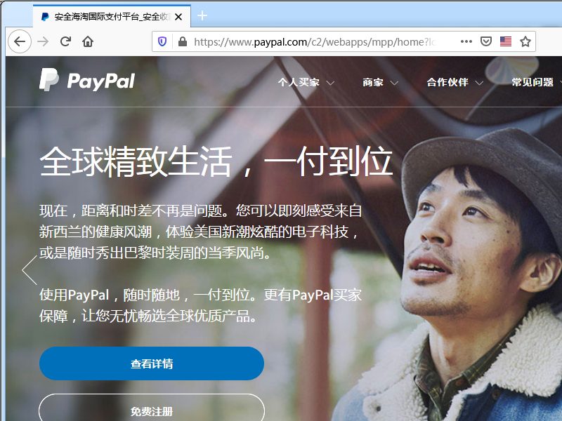

在最新版本的 Firefox 和 Chrome 中，访问使用 EV 证书的 https 站点时，地址栏不显示绿色的锁头图标和公司信息，取而代之的是和 DV 证书站点相同的灰色锁头图标。

===

早在今年8月份，Firefox 就宣布在10月发布 70.0 版本时将取消 EV 证书的特殊显示待遇。理由大致是：

1. 额外的公司信息让用户迷惑，占用屏幕空间；
2. 强调 EV 证书影响用户认知，耽误推进让用户无感知的默认 https 体验进程；
3. 用户并不在意 EV 证书的绿色标识，反欺诈作用并不显著。
4. Safari 从去年开始就隐藏了公司信息。

然而，他们比 Safari 更加激进，统一显示为灰色的图标。这一消息被看作是证书行业的重大利空。号称能让浏览器地址栏变绿的各大 EV 证书商，心里有一万句妈卖皮，不知能跟谁讲。

浏览器与证书商之间的矛盾由来已久，Chrome 㨃证书商也不头一次了，8月份时就曾提议缩减证书有效期，并遭到了拒绝。那么，EV 证书真的没有存在的必要了吗？

## EV 与 UI 设计

在显示器分辨率普遍宽度为 1920 的今天，留给浏览器地址栏的宽度至少有 1200 像素。在 Firefox 的界面中，地址栏前后各有一块留白空间；内部左侧是隐私图标，右侧是阅读模式和插件快捷图标。这么空旷的地址栏，若说容不下「宝鸡有一群怀揣着梦想的少年相信在牛大叔的带领下会创造生命的奇迹网络科技有限公司」这么长的公司名还有点道理，可是连「PayPal Inc.」「Apple Inc.」都放不下吗？

当然浏览器也并非都是以最大化窗口运行的，Firefox 又怎么处理地址栏的呢？他们把 URL 藏起来一部分……那么，为什么公司信息不能得到同样的待遇呢？我见过一些小白用户，几乎从来不手动输入 URL，都是在搜索引擎查关键字，点击链接进入网站的；对这些人来说，让人迷惑的 URL 也没有什么用，复杂的按钮也没有什么用，干脆藏起来好了，这可是能省下一大块的屏幕空间的。

在移动版本里，横向的空间的确是非常有限，甚至默认只显示域名，点击之后才看得到完整的 URL。那么把 EV 的信息分成两行显示在域名上面，也不是什么难事啊。

用户虽然懒，但并不傻。公司信息让人迷惑，并不成为一个问题；最新版的 Firefox 中只显示了一句「Certificate issued to: PayPal Inc.」这种语焉不详的描述，才是让人迷惑的根源。点击公司信息时，提示一句「经 XXX 验证，该网站由 PayPal Inc. 运营/所有」，傻子都知道什么意思。

## EV 与无感知 HTTPS

Mozilla 和 Google 认为的无感知 HTTPS 就是管你是 EV/OV/DV，统统显示个小黑锁好啦。毕竟为了无感知，他们都敢隐藏掉 `http://www`。无感知 HTTPS 也是一个不存在的需求，不安全、传输安全、商业安全并不能简化为不安全和安全。浏览者并不是 HTTPS 推广的阻力，浏览者能否区分黑锁和绿锁并不能自动让网站支持 HTTPS。

连专制的满清政府都知道，为了执行剃头令，只杀不愿留辫子的就行了，没必要连金钱鼠尾的小辫子旗人都杀掉。想象一下满清大兵对你说，我们要的是无感知辫子，你留的头发太少了，影响了其他人对辫子的认知，拉下去砍了！

## EV 与反欺诈

用户不在意 EV，这是浏览器和证书商的问题，宣传不力。用户不在意的东西多了，包括 HTTPS。用户懒得敲 `https://`，业内提出了 HSTS Preload，而不是放弃 HTTPS。

用户也不在意 Windows 驱动和 Mac OS App 的代码签名证书啊，你们怎么不把签名信息藏起来呢？哦，抱歉，这是人家微软和苹果操作系统的事儿，Mozilla 和 Google 想管也管不着。

部分用户刚刚开始注意到了证书绿色的含义，废掉 EV 对反反欺诈的助力倒是很显著。如果你收到一封邮件，里面有一个链接「[https://www.apple.com](https://www.аpple.com)」，允许你看 HTML 源码，你敢点开吗？放心地点吧，虽然这不是苹果官网。目前为止这还是一个不存在的网站。网址里的 `а` 并不是普通的小写字母 `a`。

推友[@ViafaSia](https://twitter.com/ViafaSia/status/854051035580481536) 还发现了一个使用 Let's Encrypt 颁发的 DV 证书的钓鱼网站，网址里的 apple 每一个字母都是相似的字符。这里还有一个，<https://раураӏ.com>，请用您的 Firefox 打开，对比一下真正的 <https://paypal.com> 您就明白，Mozilla 跟 Google 站在一起是多么愚蠢，因为 Chrome 对 IDN 域名显示的方式并不一样。

你可能掌握了一些小技巧来识别伪装的链接，比如鼠标放在链接上看浏览器状态栏的真实网址，或者留意是否为 HTTPS 链接。但依然逃不过高级钓鱼网站。

## EV 与 Safari

Safari 虽然早早地就藏起了EV公司信息，但直到最新发布的 iOS/iPad OS 13.2 和 Catalina，Safari 仍然为 EV 证书站点显示为绿色的地址栏。Google 携用户为天子，阻塞圣听以令各证书商诸侯，且一副「苹果敢点灯，我就敢放火」的州官嘴脸，Mozilla 则显露出跟在州官后面扇风的狗腿子姿态。

证书商们一直以来躺着挣钱，Google 看不顺眼，Chrome 做大了之后有了话语权，终于可以指手划脚了。有 Mozilla 支持还不够，顺便拉 Safari 下水来给自己正名罢了。

有人说，EV 那么贵，又不支持 Wildcard，打压一下也是好的。Google 完全有能力可以推出竞品来促进行业发展啊，但如今这架势看是要把 EV 直接打死了。

## EV 会有何变化？

也许 EV 从此退出历史舞台，也许经各方博弈之后重获新生。证书商们也该采取点行动了。

1.   由 EV 上游企业，向浏览器厂家交钱，毕竟脖子在人家手里掐着，赚了钱应该分点；
2.   像 HSTS 一样，提供一个 PRELOAD 列表（或者更好用的 HPKP），使用 EV 证书的站点自动提交到列表中；判断域名相似程度，达到阈值且非 EV 证书直接提示用户并报告反欺诈组织；
3.   降价，趁 HTTPS 普及之势，向企业和组织普及 EV/OV。
