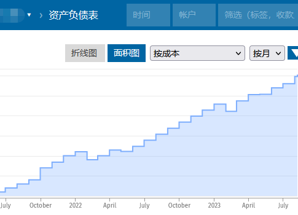

Beancount 的用户群时不时会讨论家庭账本怎么记的话题，社交媒体上也有关于要不要上交工资卡的讨论。这两者在记账的操作上关联度极强，本文将探讨一种类似企业的家庭财务机制，期望能给两个问题的关注者一些参考。

===

坚持记账的人若想将记账推广给家人，还是建议不要直接代劳，而是培养其自己记账的习惯。如果你的老板不给你报销，那么你也不会愿意收集发票交给会计。即使不给报销，帮记账是义务劳动，那么一个人也不喜欢他找的会计对他的消费唠唠叨叨。所以，要么给钱，要么闭嘴，否则不要代家人记账。改善家庭财务管理现状另有他法。

## Beancount 等记账软件能做什么

先聊聊记账软件。如果两个人产生了一笔交易，各自记到自己的账本中，那么两个记录可能是镜像的，或者不相关的。比如甲方记成支出，乙方记成收入。

```beancount
;甲方账本
2023-08-11 *
  Assets:Cash   -10 USD
  Expenses:Food
```

```beancount
;乙方账本
2023-08-11 *
  Assets:Cash    10 USD
  Income:Sales
```
如果未来他们合并为一家公司，那么账本合并会比较麻烦；分割账本也同理。不要想着将两个经济体的账混记在一起。一个 Beancount 账本的适用范围是独立的小型经济体，可以是一家杂货店，也可以是「个人」。

当然，Beancount 是适合记录多人消费的，通过自定义 meta 和灵活的账户系统，很容易地记录家庭成员的收支状况。账本体现了财务制度，如果一家人有财务大权独揽者，就建立大一统账本。若是分开结算，则可为个人、事项建立单独的账本。不管采用怎样的账本结构，Beancount 都能胜任。

解决家庭中的财务管理方面的冲突，要对账本有边界感，从制度上明确家庭账本的边界。公司的财务制度则是非常好的参考。

## 把家庭当企业会怎样

家庭作为人类共同生活单位，像是一种特殊的企业，每个人既是股东又是员工，甚至也是董事。家庭成员贡献收入、索取开支，参与财务决策。我们将家庭当企业来考虑，看看一个像企业的家庭财务机制应当是怎样的。比如假设白云和黑土的家是一家公司，我们可以称之为「铁岭白云黑土过日子有限公司」。二位以笔、桌、锅、秋波等实物，以及技术入股，各自占股50%。

首先白云和黑土创造的收入应当归公司所有。其次，白云和黑土应该享受基本工资，也就是零花钱，满足日常所需。白云的版税收入[^baiyun-heitu-2006]成为公司主要经济收入，她应当享受销售提成奖励，获得更多的零花钱，否则将没有动力续写《月子》系列。

公共事项开支由公司报销，白云黑土从乡里到北京的车票[^baiyun-heitu-1999]，应该由公司统一报销。火炬手竞选活动经费[^baiyun-heitu-2008]亦应由公司提供。另外，下蛋公鸡的炒作合约虽然是白云所签，而鸡是儿媳妇炖的，其违约金是一种意外损失[^baiyun-heitu-2007]，理论上可由董事会商讨决定是否由公司承担。

白云执意租了一件貂皮大衣，应该花的是自己的钱，公司不应干涉。

财务管理方面两人可以分工合作，白云管钱，黑土管账。规章制度的各个条目的具体金额，由董事会商谈决定。

## 过日子有限公司有何好处

每人都有经过商讨认同的、各自独立的、金额与贡献挂钩的一份零花钱（或简化为按一定比例上交个人收入，余下留给个人），这部分钱并不影响家庭储蓄大计，应由个人随意安排，消费无需事先报备，只要没有犯原则性错误，事后也不会倒查二十年。可避免无钱可花的尴尬，也不会不小心花得太多。多劳多得，充分动员大家的劳动积极性，避免出现家庭地位不如宠物狗的局面。

公共开支需要商讨确定，入账需要消费凭证，事后全员知情。这样可减少不合理消费，控制家庭支出，避免私自挪用资金。如果你的提案被大家否决，不服的话，可以花自己的零花钱；想要公款报销，就要改进提案，努力说服大家。公正公开，透明详尽，以后要么谁都别翻旧账（字面意思），要么大家一起翻。

钱账分工是以上所述能够落实的基础。就像平日记账需要时不时地校对一下余额，也像开店的也要定期盘点，可以隔段时间就查查账、对对数，开个家庭经营会。这样钱账两清，管账的不担心钱，管钱的不担心账。

若家中有小孩儿，这套机制的运作说不定能培养他的财商。

## 如何用 Beancount 进行具体操作

可使用 Fava 建立多用户实例[^ubuntu-fava-server-for-multiple-user]，可供多人共享某公共账本，同时还可独享个人账本。以白云和黑土为例，建立公共账本如下：

```beancount
1999-01-05 * "白云" "转入"
  Assets:Family   500 CNY
  Income:Receivable

1999-01-06 * "黑土" "转入"
  Assets:Family   600 CNY
  Income:Receivable

1999-02-01 * "中国铁路" "铁岭-北京"
  Assets:Family  -200 CNY
  Expenses:Transport:Railway

1999-02-03 * "中国铁路" "北京-铁岭"
  Assets:Family  -200 CNY
  Expenses:Transport:Railway

1999-02-05 * "白云" "转入"
  Assets:Family  5000 CNY
  Income:Receivable

1999-02-06 * "黑土" "转入"
  Assets:Family   700 CNY
  Income:Receivable

; ...

2007-02-01 * "牛策划" "下蛋公鸡宣传"
 Assets:Family  20000 CNY
 Income:Other

2007-02-01 * "牛策划" "下蛋公鸡违约"
 Assets:Family -40000 CNY
 Expense:Other

2007-02-01 * "牛策划" "鸡肉销售"
 Assets:Family  20000 CNY
 Income:Sales

; ...

2008-02-01 * "" "火炬手宣传花费"
 Assets:Family   -100 CNY
 Expenses:Other
```

下面的这张 Fava 截图来自一个真实的家庭账本，是建立账本以来的净资产的面积图。



## 结语

在 V2EX 有一个讨论家庭财务问题的帖子[^v2ex-764964]，提到了联名账户[^lianming]，有兴趣的朋友可以了解一下，或许会适合家庭使用。

如果大家都既不想独揽财政大权，也不想被剥夺财政权力，就不会有上缴工资卡[^x-status-1689805394686914560]，偷偷投资失败[^2000w]，无钱治病[^thepaper-1645198]等等家庭悲剧发生。

[^baiyun-heitu-1999]: 1999 [《昨天 今天 明天》](https://zh.wikipedia.org/wiki/%E6%98%A8%E5%A4%A9_%E4%BB%8A%E5%A4%A9_%E6%98%8E%E5%A4%A9)
[^baiyun-heitu-2006]: 2006 [《说事儿》](https://zh.wikipedia.org/wiki/%E8%AF%B4%E4%BA%8B%E5%84%BF)
[^baiyun-heitu-2008]: 2008 [《火炬手》](https://zh.wikipedia.org/wiki/%E7%81%AB%E7%82%AC%E6%89%8B_(%E5%B0%8F%E5%93%81))
[^baiyun-heitu-2007]: 2007 [《策划》](https://zh.wikipedia.org/wiki/%E7%AD%96%E5%88%92_(%E5%B0%8F%E5%93%81))
[^ubuntu-fava-server-for-multiple-user]: [《搭建多用户、多账本 Fava 服务器》](https://dallas.lu/ubuntu-fava-server-for-multiple-user/)
[^v2ex-764964]: [结婚的 v 友都是如何处理夫妻财务问题的](https://www.v2ex.com/t/764964). V2EX. 2021-03-25
[^lianming]: 联名账户 [百度百科](https://baike.baidu.com/item/%E8%81%94%E5%90%8D%E8%B4%A6%E6%88%B7/3739581)
[^x-status-1689805394686914560]: <https://x.com/tindingtin/status/1689805394686914560>
[^2000w]: 孤岛的人. [《天啊！被骗了20000000啊！》](https://m.163.com/dy/article/IBCFFUIT05564HA1.html). 网易新闻. 2023-08-05. 女子被骗2000万，称：千万别告诉我老公！
[^thepaper-1645198]: [《成都一男子7年上交妻子工资70余万，患癌后妻子拒付医疗费》](https://m.thepaper.cn/kuaibao_detail.jsp?contid=1645198). 澎湃新闻. 2023-03-22.