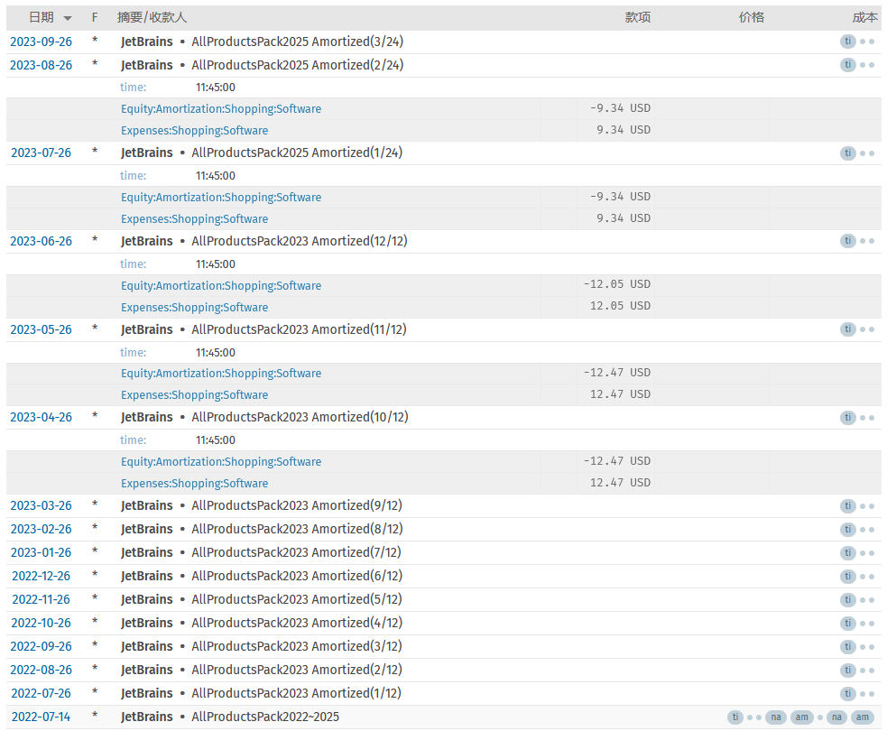

Double-entry bookkeeping software such as Beancount makes it easy for individuals to use the bookkeeping skills of an accountant as well, and gradually develop the habit of looking at statements to assess their financial situation. When there is a large expense in a given month, it is necessary to amortize the expense to future months to better reflect the cost of living. This article explores the experience of using amortization and depreciation, as well as describing related plug-ins.

===

## Does personal bookkeeping require amortization and depreciation?

To give an example that has been given before [^rent-example], if you prepay a year's rent at the beginning of the year, you should see a lump sum for rent expense on each monthly statement; not just one lump sum at the beginning of the year. Because rent is generally billed on a monthly basis, when you are considering whether or not to move, you will also take into account the monthly rent expense. It's also more complicated if you sign a contract at a time other than the beginning of the year, and if you sign a contract for more than a year. And with amortization, you'll see the rent expense on your statement each month, which makes it easier to make a decision.

By the same token, if you purchased a computer at the beginning of the year, you should see an entry for depreciation of the computer on your monthly statement each month. That way in the future, when you resell a used computer, it will also better reflect the value of the computer [^sspai-real-cost]. Every time I see an MBP come out new, I marvel at the fact that my 2015 model has another five years left in it. If it was purchased for 2000 USD, planned to use it for 2 years [^note:depreiation-peroid], and still sells for 200 USD used after that, then the average is 30 USD per month, which is an acceptable cost.

## How to record amortization and depreciation

Both operations, amortization and depreciation, involve splitting a transaction into multiple transactions and spreading them into the future, with the amount of each transaction being a part of the original transaction.

The difference is that general amortization is generally used for intangible assets in a business and depreciation is used for tangible assets. In personal books, there are generally not too many intangible assets, and you can mix and match, or use only one of them. For example, annual rent payments can be interpreted as an intangible asset where you are paying for the right to live there for a limited period of time, whereas a computer or car is a tangible asset where you are paying for the product itself.

You can also think of amortization as being used to calculate consumption and depreciation as being used to calculate assets. Depends on how you look at these transactions.

### Amortization of rent

For example, record the annual payment rent, originally recorded as:

```beancount
2023-01-01 *
  Assets:Cash          -12000 USD
  Expenses:Rent
```

The cash account flows directly into the rent consumption account. Amortization may then be changed:

```beancount
2023-01-01 * ^rent-2023
  Assets:Cash          -12000 USD
  Expenses:Rent          1000 USD
  Equity:Prepayment

2023-02-01 * ^rent-2023
  Equity:Prepayment     -1000 USD
  Expenses:Rent

2023-03-01 * ^rent-2023
  Equity:Prepayment     -1000 USD
  Expenses:Rent

;... Future months omitted
```

The equity account `Equity:Prepayment` is used as a temporary account to record the amount of amortization; each month another transfer from that account to the rent expense account is recorded for an amount that is part of the amortization. This way, each month's statement will see an entry for rent expense.

This temporary account can be of any type depending on personal preference and needs, such as `Expenses:Unamortized', `Assets:Prepayment', etc. The reason I recommend choosing the `Equity` type is that it does not affect the balance sheet totals and it does not show up on the statement. It's true that the cash is reduced by 12000 USD the moment you pay the rent, but the spending hasn't materialized in each month, and it makes more sense to use Equity account.

If you have multiple amortizations in your books, you can create a temporary account for each amortization, such as `Equity:Prepayment:Rent`, `Equity:Prepayment:Insurance`, and so on.

### Depreciation of computers

The previous discussion mentioned that depreciation and amortization can be mixed, for example, if a computer is purchased, you can also record the purchase as amortization (as if it were a credit card installment), or you can record it as depreciation of the asset. If recorded as depreciation, first change it to a purchased asset:

```beancount
2023-01-01 *
  Assets:Cash          -2000 USD
  ;Expenses:Digital ;No longer recorded as expenses
  Assets:Computer
```

Ever get the feeling like you're running a company for an optimized asset structure? It's a good feeling that your money hasn't disappeared into thin air, it's just with you in a different form.

Depreciation may be recorded additionally:

```beancount
2023-01-01 *
  Assets:Computer            -30 USD
  Expenses:Digital

2023-02-01 *
  Assets:Computer            -30 USD
  Expenses:Digital

2023-03-01 *
  Assets:Computer            -30 USD
  Expenses:Digital

;... Future months omitted
```

### Make Better

In the above example, it is tedious to write down a transaction every month. Of course, Beancount allows us to write down future transactions in advance and filter out future transactions using the time parameter. But this is still not convenient enough, because we have to write down a transaction every month and remember to change the date. That's where the plugin comes in.

## Plugin beancount-periodic

Next change the above example to be implemented as a plugin. I recommend the plugin I wrote [beancount-periodic](https://github.com/dallaslu/beancount-periodic), which I have been using myself.

Example of rent:

```beancount
2023-01-01 *
  Assets:Cash          -12000 USD
  Expenses:Rent
    amortize: "1 Year /Monthly"
```

Example of computer:

```beancount
2023-01-01 *
  Assets:Cash          -2000 USD
  Expenses:Digital
    depreciate: "5 Year /Monthly =200"
```

Simply add a special meta to the posting of the original transaction that requires amortization or depreciation. Its content is the rules describing the amortization or depreciation, such as total period, start time, amount, salvage value, etc. The plugin will automatically calculate the amortization or depreciation amount for each month and generate the corresponding transaction.

When you resell your computer, it does not need to be recorded as income with negative expenses[^note:depr-resell]. The salvage value of 200 USD regarding depreciation is the estimated value at the beginning of the depreciation calculation. It is possible to adjust the salvage value in the initial record based on the market price at the time of resale. For example, after resale, change the salvage value to the actual transaction amount of 100 USD. Reviewing and adjusting this in the future will provide a truer reflection of the cost of living.

In addition, this plugin also supports amortization and depreciation with annual and daily cycles, as well as repeat transactions and other functions. Please refer to [README](https://github.com/dallaslu/beancount-periodic#readme) for detailed instructions on how to use the plug-in, such as the installation process and meta syntax rules.

In July of last year, I renewed my Family Bucket at JetBrains through July 2025 because of a deal. The deal was recorded like this:
```beancount
2022-07-14 * "JetBrains" "AllProductsPack2022~2025"
  time: "11:45:00"
  Liabilities:CreditCard:CN:CMB:6687         -369.38 USD
  Expenses:Shopping:Software                  149.25 USD
    narration: "AllProductsPack2023"
    amortize: "@2022-07-26~2023-07-25 /Monthly"
  Expenses:Shopping:Software                  220.13 USD
    narration: "AllProductsPack2025"
    amortize: "@2023-07-26~2025-07-13 /Monthly"
```

The one-time payment of 369 USD actually includes two orders. The plugin generates a total of 36 transactions for both orders. It just so happened that the second order went into effect last month.



As shown, the first order has a monthly amortized cost of about 12.5 USD[^note:amortized-amount], while the second order drops the monthly cost to 9.3 USD.This is acceptable because I use JetBrains products every day and I don't bother to look at JetBrains products to see if there is a new version of the JetBrains product.

In addition to that, I've used this plugin to record some other similar deals such as Github Copilot annual payments, DMIT VPS 3-year payments, broadband prepayments, and so on. Annual memberships for various services can also be recorded with this plugin.

Other plug-ins are available:

* [beancount_interpolate](https://github.com/Akuukis/beancount_interpolate) 

## Conclusion

Keep an eye on your true cost of living, and the day your passive income exceeds your cost of living, you can choose to stop working. Or set a small goal of achieving IDE/VPS/Copilot freedom first.

[^note:depreiation-peroid]: Depreciation of different types of assets in a business has different time periods, usually at least 2 years. Personal books are not required to adhere strictly to this convention.
[^note:depr-resell]: When a depreciated asset is sold, the residual value needs to be transferred out of the asset account and into the cash account.
[^note:amortized-amount]: 149 USD / 12 = 12.43 USD，Cumulative rounding errors are calculated in the last month, so the cost for June is \$12 USD.

[^rent-example]: Dallas Lu. [Beancount 记账规则不完全指北(Beancount Incomplete accounting rules)](https://dallas.lu/beancount-bookkeeping-rules-incomplete-guide/). 2022.「How are amortization and installment type transactions recorded」
[^sspai-real-cost]: ElijahLee. [折旧摊销在个人记账中的应用(Depreciation and Amortization in Personal Bookkeeping)](https://sspai.com/post/40718). 少数派. 2018. 「报表不能真实地反映生活成本(Statements do not give a true picture of the cost of living)」
