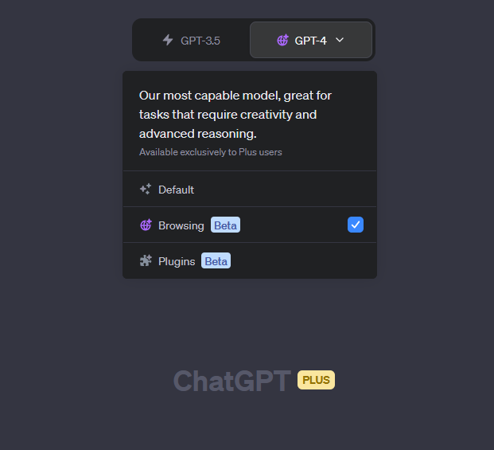

Recently, more and more people are using ChatGPT with Warp. After all, the number of export IPs of Warp is still limited. Although Warp will not be blocked, too many people with the same IP often trigger OpenAI's access frequency limit, that is, some interfaces return 429 errors, which is manifested as a large area of the chat.openai.com page. It is blank, and a loading chrysanthemum is displayed in the upper middle of the page. I have also tried the native IPs of several American computer rooms, and all are blocked without exception. Instead of looking for another airport, it is better to get it right in one step and use the US Residential IP.

===

## IPRoyal registration and purchase

IPRoyal provides home broadband IP in more than 20 countries and regions, and has both static and non-static products. Non-static charges are based on traffic, and the price for 2 GB of traffic is approximately \$12. In order to "get it right in one step", it is best to use a static residential IP, the price is \$10.8 for 90 days. Basically, the more you buy, the greater the discount [^iproyal-pricing-static]. Just think that the price of ChatGPT Plus has increased by a few dollars.

Visit IPRoyal: [https://iproyal.com/?r=dallaslu](https://iproyal.com/?r=dallaslu) (Aff) (or visit directly [https://iproyal.com](https://iproyal.com) ), click the `Register` button to register. It is recommended that the mobile phone number and country filled in during registration be consistent with the IP used during registration to ensure a successful purchase. After verifying your email, the registration is successful.

However, to purchase a Static Residential IP, you also need to go through identity verification (KYC). You may have doubts about this, but it is also easy to understand. The IP is exclusive to you during the use period. If you use it for If you engage in sensitive behavior such as accessing child pornography, the FBI will inevitably find you and issue a warning. It uses the authentication service of the Identy platform and supports mainland China identities.

Supports multiple payment methods, including credit card and Paypal, and also supports BTC (recharge consumption only).

After the purchase is successful, you can see the proxy IP port, username and password in the email or IPRoyal backend. Socks5 and http are supported. You can use the following command to verify:

```bash
curl --proxy socks5://USER:PASS@IP:PORT ipinfo.io
```

## Usage

If you are in mainland China, in order to avoid risks, it is recommended to use the socks proxy at the US exit of your line. Or add the purchased  proxy IP to the proxy rule list and do 'SOCKS5 over GFW-Fucker'.

On the server node, you can set up a Socks5 proxy so that the entire system's traffic passes through the residential IP. Although IPRoyal does not clearly state the bandwidth and traffic restrictions on static residential IP, for the purpose of improving the user experience, it is best to use offloading or switch on demand. Some services that do not require residential IP can be directly accessed. In order to obtain the highest speed. Various modern proxy service software should support setting proxy lines by domain name. The specific method is omitted here. Alternatively, all traffic to Cloudflare can be forwarded to your residential line. For example, if I try to divert Warp, I can modify the redsocks configuration file according to [previous solution](/redirect-cloudflare-traffic-back-to-warp/):

```ini showLineNumbers
redsocks {
        local_ip = 127.0.0.1;
        local_port = 12345;

        ip = IP;
        port = PORT;

        type = socks5;

        login = "USER";
        password = "PASS";
}
```

Finally you can use ChatGPT normally:



At the same time, you can add additional forwarding rules to forward target traffic such as Netflix and Google to residential lines to avoid human-machine verification, service locking and other situations that affect the user experience, and give full play to the advantages of residential IP.

## Others

Here is another provider SpaceProxy([https://spaceproxy.net](https://spaceproxy.net?ref=80864) [https://proxyline.net](https://proxyline.net?ref=209726)), that cost less. Use coupon code `dallaslu` to get 5% off.

With the residential IP, paying ChatGPT should be easier too. I hope everyone succeeds in "fighting the two superpowers"[^super-two].

[^iproyal-pricing-static]: [Static Residential Proxies Pricing ](https://iproyal.com/pricing/static-residential-proxies/)
[^super-two]: h2ruk1. [充值openai简直就是同时对抗两个超级大国....(Recharging OpenAI is like fighting against two superpowers at the same time....)](https://x.com/h2ruk1/status/1658362135037239297). 𝕏. 2022-05-16.
