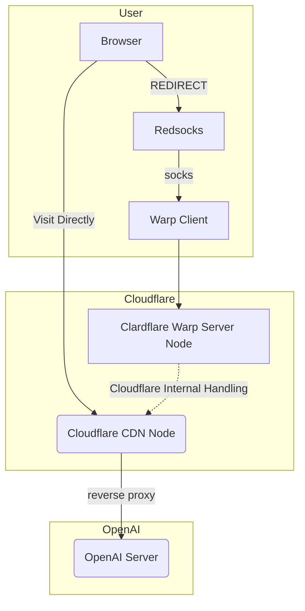

作为一家特立独行的公司，OpenAI 不仅付费困难，访问也很困难，动辄封号、出现 Cloudflare Check 页面、429错误。为了稳定使用 ChatGPT，不少网友开始借用 Warp 提供的原生 IP。为了最大限度发挥美国 VPS 的作用，减少全局 Warp 对 Cloudflare 资源的占用和浪费，应当对 OpenAI 的流量分流。再进一步，干脆让目标为 Cloudflare 的流量全部走 Warp，速度影响应该微乎其微，同时能解决 Cloudflare Check 和原生 IP 的问题。

===

当我们访问 `chat.openai.com` 或其他使用了 Cloudflare CDN 服务的域名时，解析到的 IP 是 Cloudflare 的就近节点；当我们使用 Warp 时，也是将本地流量通过 Warp 客户端转发到Cloudflare 的就近节点。这两条线的质量应该是极为相似的，所以理论上对最终的速度影响应该是极小的。对于其他的并不严格检查 IP 的服务，或者与 Cloudflare 之间有延迟的服务，就直连访问。



如果你有特殊需要，可以参考后续过程，按需设置 ipset 即可。

（以下过程在 Ubuntu 22.04 上测试通过）

## 安装 Warp

```bash
wget git.io/warp.sh
chmod +x warp.sh
./warp.sh menu
```
选择 `1` 安装 Warp 客户端，然后选择 `2` 配置 SOCKS5 代理。

## 代理软件

（以 Shadowsocks 为例）

### 创建用户

```bash
mkdir -p /home/shadowsocks
useradd -d /home/shadowsocks -g root -s /usr/sbin/nologin shadowsocks
```

### 以指定用户运行

编辑 `/etc/systemd/system/shadowsocks-libev.service`

```ini
#...

[Service]
#...
User=shadowsocks
Group=root
#...
```

重启服务
```bash
systemctl daemon-reload
systemctl restart shadowsocks-libev
```

## 安装 redsocks

```bash
apt install redsocks
```

编辑配置 `/etc/redsocks.conf`

```ini showLineNumbers
base {
        log_debug = off;
        log_info = on;
        redirector = iptables;
}

redsocks {
        local_ip = 127.0.0.1;
        local_port = 12345;

        ip = 127.0.0.1;
        port = 40000;

        type = socks5;
}
```


（实际使用中发现并不够稳定，偶尔需要手动重启 redsocks 服务器，建议可更换为其他同功能软件）

## 创建 ipset list

这里将 Cloudflare 的全部 IP 加入了列表中。如果你的分流策略不是针对 OpenAI，目标网站没有使用 Cloudflare 的 CDN 服务，也可只指定目标 IP。

```bash
apt install ipset
ipset -X cloudflare
ipset create cloudflare hash:net

# https://www.cloudflare.com/ips-v4
ipset add cloudflare 173.245.48.0/20
ipset add cloudflare 103.21.244.0/22
ipset add cloudflare 103.22.200.0/22
ipset add cloudflare 103.31.4.0/22
ipset add cloudflare 141.101.64.0/18
ipset add cloudflare 108.162.192.0/18
ipset add cloudflare 190.93.240.0/20
ipset add cloudflare 188.114.96.0/20
ipset add cloudflare 197.234.240.0/22
ipset add cloudflare 198.41.128.0/17
ipset add cloudflare 162.158.0.0/15
ipset add cloudflare 104.16.0.0/13
ipset add cloudflare 104.24.0.0/14
ipset add cloudflare 172.64.0.0/13
ipset add cloudflare 131.0.72.0/22

mkdir -p /etc/ipset/list
ipset save cloudflare -f /etc/ipset/list/cloudflare
```

编辑 `/etc/rc.local` 加入启动项
```bash
ipset restore -f /etc/ipset/list/cloudflare
```
## UFW

启用

```bash
ufw enable
```

编辑 `/etc/ufw/before.rules`

```bash
*nat
:PREROUTING ACCEPT [0:0]
:OUTPUT ACCEPT [0:0]
:POSTROUTING ACCEPT [0:0]

-A OUTPUT -p tcp -m set --match-set cloudflare dst -m owner --uid-owner shadowsocks -j REDIRECT --to-ports 12345

COMMIT
```

为避免出现重复 `REDIRECT` 的奇怪的问题，最好对要处理的流量做一些条件限制，比如 `-m owner --uid-owner shadowsocks` 要求 shadowsocks 用户。而 Warp 运行在另外一个用户中，因此不会出现 loop 的情况。

频繁修改 ufw 规则时，最好先 flush-all 再 reload:

```bash
/usr/lib/ufw/ufw-init flush-all
ufw reload
```

## 测试与使用

通过客户端连接代理软件，访问 chat.openai.com，同时在 VPS 上使用 tcpdump 查看是否生效：
```bash
tcpdump -i lo port 40000
```

## 其他

当时为了用 Warp 稳定访问 ChatGPT，拜读了陈皓的[科学上网教程](https://github.com/haoel/haoel.github.io)。当时对 Warp 分流方案不明所以，但犯懒搁置了。直至昨日见到讣闻后，才默默查资料，遂有此文。希望另一个世界没有 GFW。