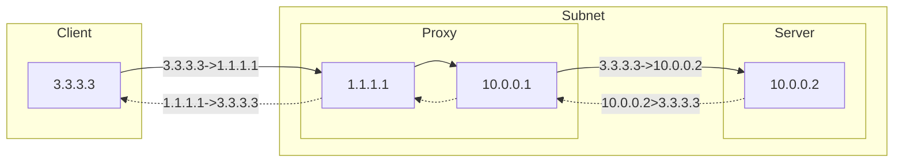
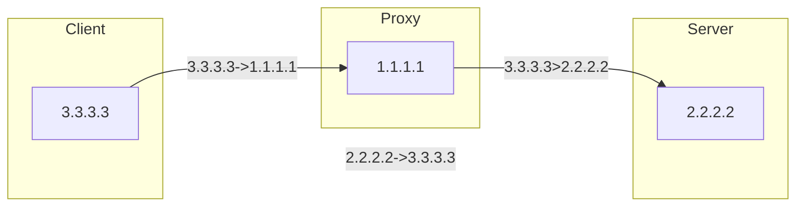
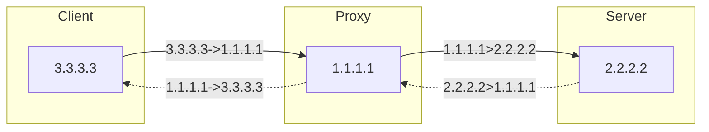
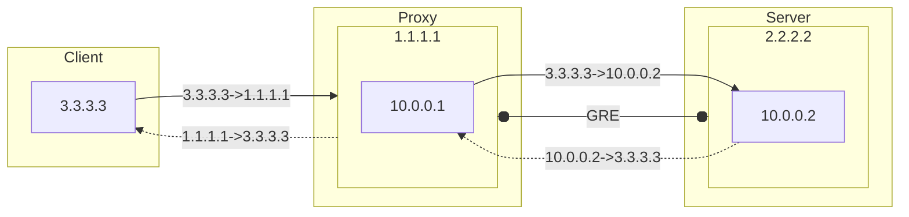

Previously, I used an idle IP to set up port forwarding to hide my Forgejo server's IP, which worked excellently. However, when I recently set up my email service, I discovered that using iptables for port forwarding over the public network does not allow the application to correctly obtain the client's IP. This was not an issue for informal external applications. However, since my email service uses Greylist to filter spam, the sender's IP is an important parameter. Therefore, I need to obtain the actual client IP.

===


## Forwarding at the Gateway

Forwarding a port from the gateway to a server within the internal network is very simple and can be done with a single command:

```bash
iptables -t nat -A PREROUTING -p tcp -d 1.1.1.1 --dport 80 -j DNAT --to-destination 10.0.0.2:80
```



In the internal network server application, the correct client IP can be directly obtained. Whether using tcpdump or netstat, you can see that the IP from the internet has established a connection with the local machine.

## Public Network Forwarding

Similarly, you need to specify the forwarding target:

```bash
iptables -t nat -A PREROUTING -p tcp -d 1.1.1.1 --dport 80 -j DNAT --to-destination 2.2.2.2:80
```

So far, this forwarding does not work correctly. When 3.3.3.3 from the internet communicates with 1.1.1.1:80, the packet is forwarded to 2.2.2.2:80. When the web server returns the handshake message, its packet should follow its own routing rules and is returned to 3.3.3.3 via 2.2.2.2. This connection cannot be established.



Therefore, we need to change the source of the packet on 1.1.1.1 to 1.1.1.1 to forward the response from 2.2.2.2, ensuring normal communication and connection with 3.3.3.3.



using SNAT：

```bash
iptables -t nat -A POSTROUTING -p tcp -d 2.2.2.2 --dport 80 -j SNAT --to-source 1.1.1.1
```

Using restricted MASQUERADE

```bash
iptables -t nat -A POSTROUTING -p tcp -d 2.2.2.2 --dport 80 -j MASQUERADE
```

Using broad MASQUERADE
```bash
iptables -t nat -A POSTROUTING ! -o lo -j MASQUERADE
```

This also makes 2.2.2.2 always think that 1.1.1.1 is communicating with it, completely unaware of the existence of 3.3.3.3.

## Retaining Client IP with Public Network Forwarding

If a packet sent from 1.1.1.1 to 2.2.2.2 has the source IP as the original client IP, say 3.3.3.3, and the destination as 2.2.2.2. When 2.2.2.2 receives the data, if there are some filtering rules, it may not respond because the route from 2.2.2.2 to 3.3.3.3 is different from where the packet came from.

If we disable these filtering rules, 2.2.2.2 may be more vulnerable to attacks, as it becomes hard to differentiate. If we configure an extra IP on 2.2.2.2 specifically to accept forwarding from 1.1.1.1, it would be wasteful. Changing 2.2.2.2's routing to make all its traffic go through 1.1.1.1 would make it unable to handle direct requests from the internet normally.

### Establishing a Dedicated Tunnel

Some proxy implementations, such as Haproxy or Transport Proxy, require 2.2.2.2 to have application-level support. For example, in nginx, you need to explicitly specify proxy_protocol or transport. If the application does not support it, it cannot be used.

Moreover, this scenario only involves direct connection between two nodes, without needing load balancing or high availability. Using iptables is simpler than using proxy software.

Therefore, a better approach is to establish a dedicated tunnel between 1.1.1.1 and 2.2.2.2. There are many ways to establish a tunnel. Similarly, there are many other choices for establishing a tunnel, such as OpenVPN / WireGuard. Given the requirements of this scenario, I chose the simpler GRE.

#### GRE

Establish the tunnel on 1.1.1.1 and configure the IP address.

```bash
ip tunnel add gre1 mode gre remote 2.2.2.2 local 1.1.1.1 ttl 255
ip addr add 10.0.0.1/24 dev gre1
ip link set gre1 up
```

Forward the local public network traffic to the other end of the tunnel.

```bash
iptables -t nat -A PREROUTING -p tcp -d 1.1.1.1 --dport 80 -j DNAT --to-destination 10.0.0.2:80
```

Establish the tunnel on 2.2.2.2 and configure the IP address.

```bash
ip tunnel add gre1 mode gre remote 1.1.1.1 local 2.2.2.2 ttl 255
ip addr add 10.0.0.2/24 dev gre1
ip link set gre1 up
```

There is no need to disable rp_filter. Add the routing table:

```bash
echo "200 custom" >> /etc/iproute2/rt_tables
```

Set routing table rules and routing information to let the traffic at this tunnel endpoint return to its origin.

```bash
ip rule add from 10.0.0.2 table custom
ip route add default via 10.0.0.1 dev gre1 table custom
```



## Conclusion

Using iptables port forwarding and GRE tunnels, you can easily hide the real IP address while still obtaining the actual client IP. This process does not require installing additional software and is applicable to various applications without needing further adaptation. It's an excellent solution for using an idle VPS as a front-end server, fully utilizing a VPS with a good connection to provide multiple IP entry points for your application, making it faster and more secure.