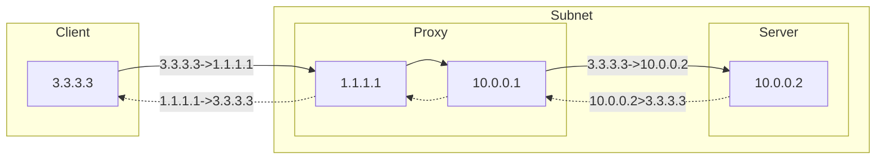
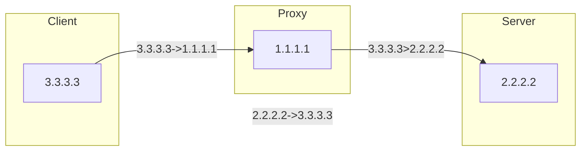
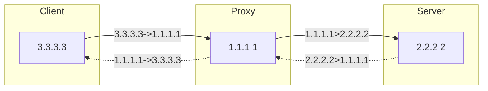
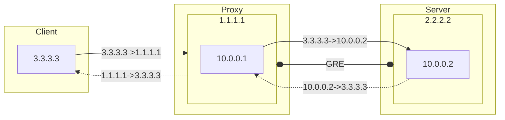

此前，我曾经使用一个闲置的 IP，做了端口转发，以隐藏自己的 Forgejo 服务器 IP。这种方式简直太棒了。直到我最近搭建了自己邮箱服务，发现使用 iptables 经由公网做的端口转发，在应用端并不能正确获得客户端 IP。在非正式的对外应用中，这一点并无影响。邮箱服务中使用 Greylist 来抵御垃圾邮件，发信者的 IP 是一个重要的参数。因此我需要获得真正的客户端 IP。

===


## 在网关转发

在网关将某端口转发到内网中的一台服务器，是非常简单的，只需要一句话：

```bash
iptables -t nat -A PREROUTING -p tcp -d 1.1.1.1 --dport 80 -j DNAT --to-destination 10.0.0.2:80
```



在内网服务器的应用中，能直接获得正确的客户端 IP。无论是使用 `tcpdump` 还是 `netstat` 都能看到来自互联网的 IP 与本机建立了连接。

## 在公网转发

同样需要指定转发目标：

```bash
iptables -t nat -A PREROUTING -p tcp -d 1.1.1.1 --dport 80 -j DNAT --to-destination 2.2.2.2:80
```

到目前为止，这个转发并不能正常使用。当来自互联网的 3.3.3.3 向 1.1.1.1:80 通讯时，数据包被转发到了 2.2.2.2:80，其 Web 服务在返回握手消息时，其数据包则按自身的路由规则，经过 2.2.2.2 出口返给了 3.3.3.3。这个连接是不能建立的。



于是我们需要在 1.1.1.1 中，把数据包的来源也修改成 1.1.1.1，以转发 2.2.2.2 给出的回应，以保证与 3.3.3.3 的正常通讯和链接。



使用 SNAT：
```bash
iptables -t nat -A POSTROUTING -p tcp -d 2.2.2.2 --dport 80 -j SNAT --to-source 1.1.1.1
```

使用有限制条件的 MASQUERADE
```bash
iptables -t nat -A POSTROUTING -p tcp -d 2.2.2.2 --dport 80 -j MASQUERADE
```

使用宽泛条件的 MASQUERADE
```bash
iptables -t nat -A POSTROUTING ! -o lo -j MASQUERADE
```

这样也造成了 2.2.2.2 一直以为是 1.1.1.1 与自己通讯，完全不知 3.3.3.3 的存在。

## 公网转发保留客户端 IP

如果从 1.1.1.1 向 2.2.2.2 发送的数据包，其来源为原始客户端 IP，假设为 3.3.3.3，其目标为 2.2.2.2。那么当 2.2.2.2 收到数据后，如果有一些过滤规则存在，可能根本不会作出响应。因为 2.2.2.2 通往 3.3.3.3 的路由，与这个数据包的来路并不相同。

如果我们关闭这些过滤规则，则可能导致 2.2.2.2 这个 IP 会更容易受到攻击，因为很难区分。如果在 2.2.2.2 上，额外配置一个 IP，专门接受来自 1.1.1.1 的转发，又比较浪费。如果修改 2.2.2.2 的路由，使其全部流量都经过 1.1.1.1，又会使得 2.2.2.2 无法正常处理来自互联网的直接请求。

### 建立专用隧道

一些代理实现的方式，比如 Haproxy 或者 Transport Proxy，都需要 2.2.2.2 在应用层面做支持。如在 nginx中，需要明确指定 proxy_protocol 或者 transport。如果应用不支持，那么就无法使用。

此外，这个场景只有两个节点直连，并不需要负载均衡高可用之类，使用 iptables 比使用代理软件更简单。

所以，一个更好的办法是，给 1.1.1.1 和 2.2.2.2 建立一个专用的隧道。建立隧道有很多种方式。同样地，建立隧道也有很多其他选择，比如 OpenVPN / WireGuard，鉴于这个场景需求，我选择了更简单的 GRE。

#### GRE

在 1.1.1.1 上 建立隧道，并配置 IP 地址。

```bash
ip tunnel add gre1 mode gre remote 2.2.2.2 local 1.1.1.1 ttl 255
ip addr add 10.0.0.1/24 dev gre1
ip link set gre1 up
```

将本地公网的流量，转发到隧道的另一端。

```bash
iptables -t nat -A PREROUTING -p tcp -d 1.1.1.1 --dport 80 -j DNAT --to-destination 10.0.0.2:80
```

在 2.2.2.2 上建立隧道，并配置 IP 地址。

```bash
ip tunnel add gre1 mode gre remote 1.1.1.1 local 2.2.2.2 ttl 255
ip addr add 10.0.0.2/24 dev gre1
ip link set gre1 up
```

甚至已经不需要关闭 rp_filter 了。添加路由表：

```bash
echo "200 custom" >> /etc/iproute2/rt_tables
```

设定路由表规则和路由信息，让这个隧道端点的流量，哪里来就哪里去。

```bash
ip rule add from 10.0.0.2 table custom
ip route add default via 10.0.0.1 dev gre1 table custom
```



## 结语

使用 iptables 端口转发、GRE隧道，可轻松实现隐藏真实 IP 的同时，还能获取到真实的客户端 IP。这个过程，并不需要安装额外的软件，同时也适用于各种应用软件而无需另做适配。非常适合使用闲置 VPS 做前置机，充分利用线路好的 VPS，为你的应用增加多 IP 入口，更快更安全。