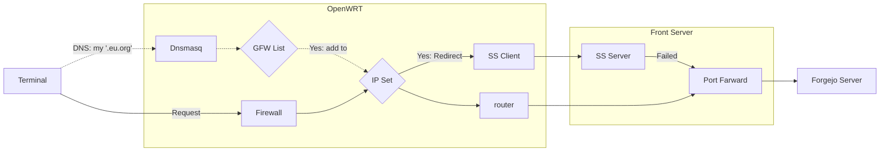

For a while now, my self-hosted Forgejo has been failing to pull and push via ssh. It's always working, and then something goes wrong, so I have to switch to a different IP, and it's immediately fine. Even if I ignored it, it would occasionally work for some reason, but often not on the few networks I use to work on. Eventually, I resolved to fix this problem once and for all.

===

## Problem

Suppose the destination address I need to connect to is `1.2.3.4:22`.

### Disconnected

When I execute `telnet 1.2.3.4 22` in the network environment where the problem occurs, I get a prompt:

> Connection closed by foreign host.

However, there are other services running on the same server, all connecting normally.

### Connects fine from other IPs

I have tried connecting from other IPs, such as cloud hosts and mobile networks, and almost all of them work fine.

### Preliminary analysis

Obviously, there is something wrong with a few commonly used IPs, probably blocked by a firewall somewhere. But all the devices are managed by me alone, and I've never configured a policy to limit traffic or anything like that. It doesn't make sense for a device in the Internet to block my port 22 connection to a server.


Naturally, start troubleshooting the Front Server that provides port forwarding. Use tcpdump:

```bash
tcpdump -i any port 22 and host 1.2.3.4
```

Trying to connect again, the log shows:

```log
...
Flags [R.], seq 0, win 0, length 0
```

Well, it does have something to do with FrontServer.

## Misadventures

So I started testing the current UFW configuration on FrontServer one by one, restarting the firewall, checking iptables, and checking logs over and over again. Until I found the ss-server log in syslog:

```log
ss-server getpeername: Transport endpoint is not connected
```

The log output cadence is consistent with the test. It's basically correlated. But turning off `ss-server` still doesn't work.

Continuing to test other ports except 22, all ports that FrontServer is not listening on locally, and using iptables for port forwarding, are also RSTed. I searched the web, but I couldn't find anyone who had encountered similar cases.

The conversation with GPT4 has already reached 15,000 words, but still nothing.

## The light at the end of the tunnel

Finally, I had no choice but to leave FrontServer alone and decided to take a look at OpenWRT. I turned off OpenWRT's firewall service, and suddenly everything was fine.

> It works! But why?

Switch to the backup router and it works just as well. To reproduce it again, cut back to OpenWRT and open the firewall ---- still works fine. Surprisingly, the problem is not reproducible!

### What did the firewall do?

Previously added some rules to OpenWRT with nftables [^openwrt-nftables], connected to FrontServer via Shadowsocks, and configured a residential IP diversion policy [^iproyal] on FrontServer, so that it can easily access various services using the residential IPs .

When the firewall restarts, it resets the nftset so that it does not forward `1.2.3.4` traffic to the ss-server on the FrontServer, which explains the logging on the ss-server.

### Problem rationale

* There is an nftset on OpenWRT that is used to shunt to an ss-server located on Front Server.
* Front Server's IP 1.2.3.4 somehow got into the nftset.
* When trying to connect locally to `1.2.3.4:22`, OpenWRT forwards the traffic via Shadowsocks to the ss-server on 1.2.3.4.
* The ss-server sends traffic to `1.2.3.4:22'
* While `1.2.3.4:22` is actually a port **FORWARD** and does not handle traffic from the FrontServer itself.

## Validation and resolution

In another environment, there is the same problem. In another OpenWRT, verify that `1.2.3.4` is added to the proxy list:

```bash
nft list table inet fw4 | grep 1.2.3.4
```

Sure enough it exists. Remove it manually:

```bash
nft delete element inet fw4 gfwlist { 1.2.3.4 }
```

Of course an additional `OUTPUT` rule can be added using UFW to allow ss-server to access the forwarded port as well [^iptables-output].

## The last piece of the puzzle

Why is `1.2.3.4` in the nftset?

Previously, I deployed a test rule on OpenWRT to automatically add the domain name of gfwlist to this nftset when accessed using dnsmasq. How did the IP of Front Server get added to the nftset? None of the domains I've used are in gfwlist, and I haven't written any dnsmasq configurations for the domains I own.

I checked all the A records for all my domains and found only a few that pointed directly to `1.2.3.4`, one of which was a free domain EU.org[^eudotorg]. Checked gfwlist right away, and sure enough, `eu.org` was listed there.

## Conclusion



Whenever I'm on my local network and access my domain name pointing to the `1.2.3.4` IP, subsequent traffic is sent through Shadowsocks, which in turn causes problems. However, you need to be careful and trust that the computer is error-free; there must be a reason behind all the strange phenomena.

[^openwrt-nftables]: Dallas Lu. [Configuring Shadowsocks rules with nftset in OpenWRT 23](/openwrt-23-shadowsocks-nftset-nftables/). ISSN 2770-7288. 2024
[^iproyal]: Dallas Lu. [Visit ChatGPT Ultimate Solution: IPRoyal US Residential IP](/iproyal-usa-static-residential-proxies/). ISSN 2770-7288. 2023
[^eudotorg]: Dallas Lu. [Register and Usage of the free domain EU.org](/eu-org-domain-register-usage/). ISSN 2770-7288. 2023
[^iptables-output]: Andy. [Answer to 'iptables port redirect not working for localhost'](https://serverfault.com/a/211544). serverfault. 2013.