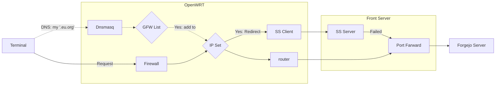

最近一段时间，自建的 Forgejo 总是无法通过 ssh 进行 pull 和 push。总是用着用着，就出问题了，只好切换到其他 IP，立即就正常了。即使置之不理，偶尔也会莫名正常，但在常用的几个工作网络却经常不行。最终，我决心要彻底解决这个问题。

===

## 问题现象

假设我需要连接的目标地址是 `1.2.3.4:22`。

### 连接总是断开

当我在出现问题的网络环境中执行 `telnet 1.2.3.4 22` 时，会有提示：

> Connection closed by foreign host.

但同服务器上还运行着其他服务，均可正常连接。

### 从其他 IP 可正常连接

尝试过从其他 IP，比如各地云主机、移动网络，几乎都可正常连接。

## 初步分析

很明显，常用的几个 IP 出了问题，可能是被哪里的房火墙阻断了。但所有的设备都是我一人管理，从来没有配置过限流之类的策略。互联网中的设备也没有道理阻断我连接某台服务器的 22 端口啊。


自然，开始排查提供端口转发的 Front Server。使用 tcpdump：

```bash
tcpdump -i any port 22 and host 1.2.3.4
```

再次尝试连接，日志显示：

```log
...
Flags [R.], seq 0, win 0, length 0
```

嗯，果然和 FrontServer 有关系。

## 误入崎途

于是开始在 FrontServer 上逐个测试当前的 UFW 配置，一遍一遍不厌其烦地重启防火墙，检查 iptables，查看日志。直到在 syslog 中发现了 ss-server 日志：

```log
ss-server getpeername: Transport endpoint is not connected
```

日志输出节奏与测试一致。基本上是有关联了。但关掉 `ss-server` 仍然不起作用。

继续测试除 22 外的其他端口，凡是 FrontServer 本地没有监听、用 iptables 做的端口转发，竟然也都被 RST 了。搜遍网络，也没有找到有人遇到相似的案例。

跟 GPT4 的对话已经有一万五千字，仍然一无所获。

## 柳暗花明

最终，无奈放过了 FrontServer，决定到 OpenWRT 上看一看。关闭了 OpenWRT 的防火墙服务，突然一切正常了。

> It works! But why?

切换到备用路由器，也同样正常。再复现一下，切回 OpenWRT，打开防火墙——仍然正常。问题竟然不能复现了！

### 防火墙做了什么？

此前用 nftables 给 OpenWRT 加了一些规则[^openwrt-nftables]，通过 Shadowsocks 连接到 FrontServer，FrontServer 上配置了一个住宅 IP 的分流策略[^iproyal]，这样就可以方便地使用住宅 IP 访问各种服务。

防火墙重启后，会重置 nftset。这样就不会将 `1.2.3.4` 的流量转发到 Front Server 上的 ss-server，这也解释了为何 ss-server 会有对应日志。

### 问题原理

* OpenWRT 上有一个用于分流到位于 Front Server 上的 ss-server 的 nftset
* Front Server 的 IP 1.2.3.4 不知为何进入了 nftset 中。
* 当在本地尝试连接 `1.2.3.4:22` 时，OpenWRT 通过 Shadowsocks 将流量转发到位于 1.2.3.4 的 ss-server 上
* ss-server 将流量发往 `1.2.3.4:22`
* 而 `1.2.3.4:22` 实际上是一个端口转发（**FORWARD**），并不处理 FrontServer 本机发出的流量

## 验证与解决

在另一个环境中，也有着同样的问题。在另外一个 OpenWRT 中，验证 `1.2.3.4` 是否加入了代理名单中：

```bash
nft list table inet fw4 | grep 1.2.3.4
```

果然存在。手动将其移除：

```bash
nft delete element inet fw4 gfwlist { 1.2.3.4 }
```

当然也可使用 UFW 额外添加一条 `OUTPUT` 规则，让 ss-server 也能访问到转发的端口[^iptables-output]。

## 最后一块拼图

`1.2.3.4` 为何会出现在 nftset 中呢？

此前在 OpenWRT 上部署了测试用的将 gfwlist 的域名用 dnsmasq 在访问时自动添加到此 nftset 的规则。而 Front Server 的 IP 是怎么被加入 nftset 的呢？我使用过的域名都不在 gfwlist 中，我也没有为我拥有的域名写过任何 dnsmasq 的配置。

我排查了我的所有域名的所有 A 记录，发现仅有几条是直接指向 `1.2.3.4` 的，其中一个是 EU.org 的免费域名[^eudotorg]。马上检查 gfwlist，果然，`eu.org` 位列其中。

## 结语



每当我在本地网络，访问我的指向 `1.2.3.4` IP 的域名后，后续的流量就会通过 Shadowsocks 发送，继而导致问题。但排查时需要细心仔细，要相信，计算机是没有错误的；所有奇怪的现象，背后一定有原因。

[^openwrt-nftables]: Dallas Lu. [在 OpenWRT 23 中使用 nftset 配置 Shadowsocks 规则](/openwrt-23-shadowsocks-nftset-nftables/). ISSN 2770-7288. 2024
[^iproyal]: Dallas Lu. [访问 ChatGPT 终极方案：IPRoyal 美国家宽 IP](/iproyal-usa-static-residential-proxies/). ISSN 2770-7288. 2023
[^eudotorg]: Dallas Lu. [EU.org 免费域名的注册与使用](/eu-org-domain-register-usage/). ISSN 2770-7288. 2023
[^iptables-output]: Andy. [Answer to 'iptables port redirect not working for localhost'](https://serverfault.com/a/211544). serverfault. 2013.